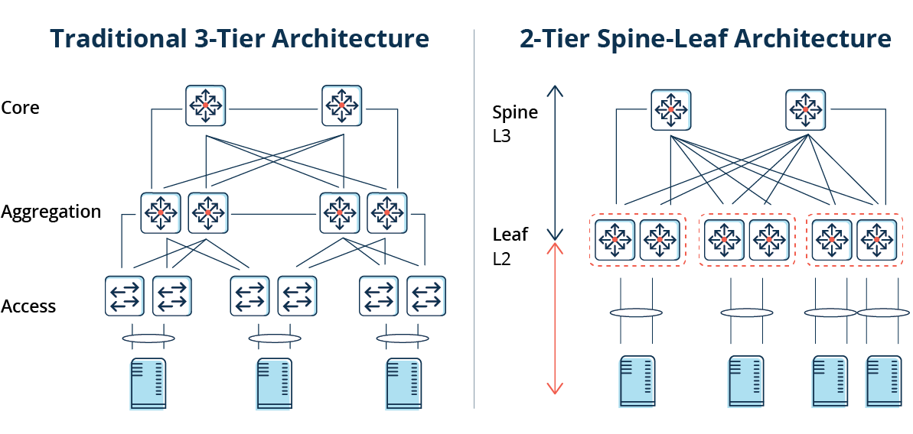
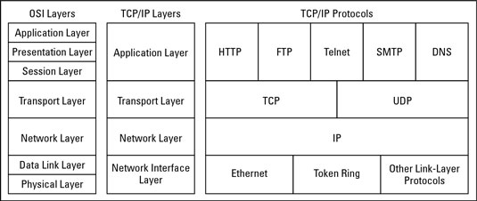
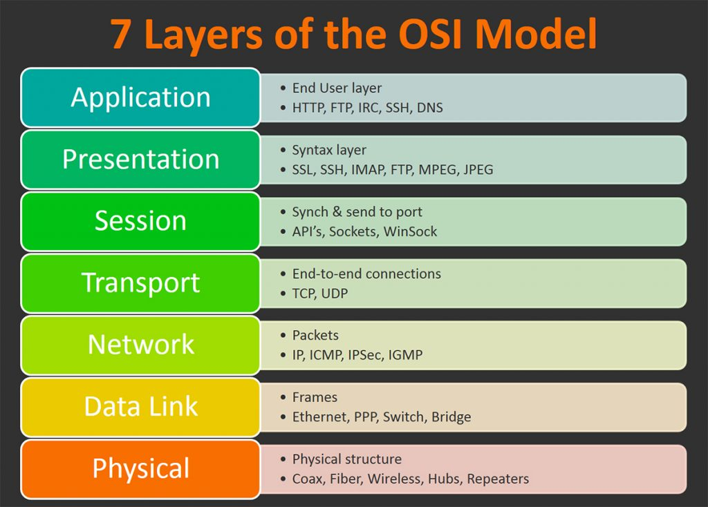
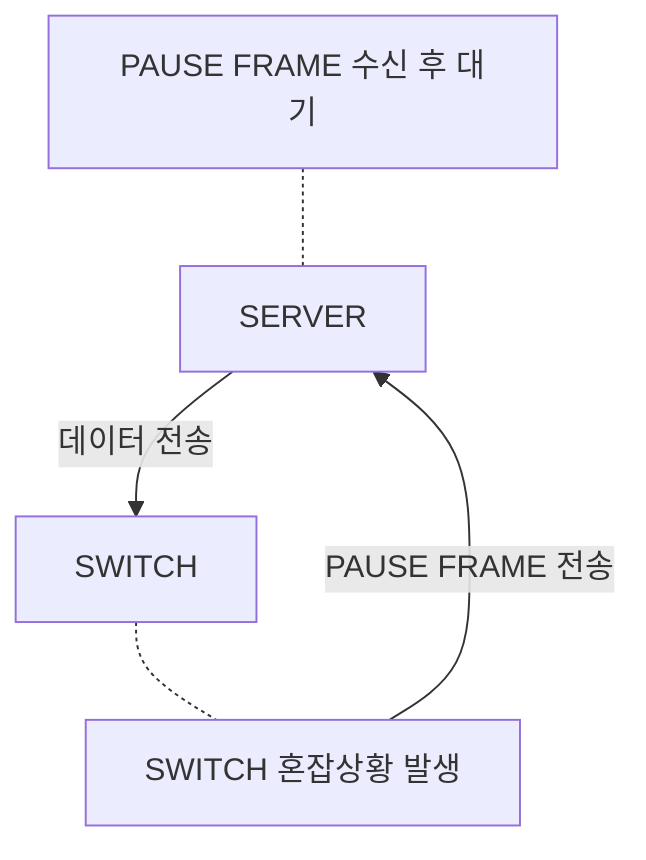
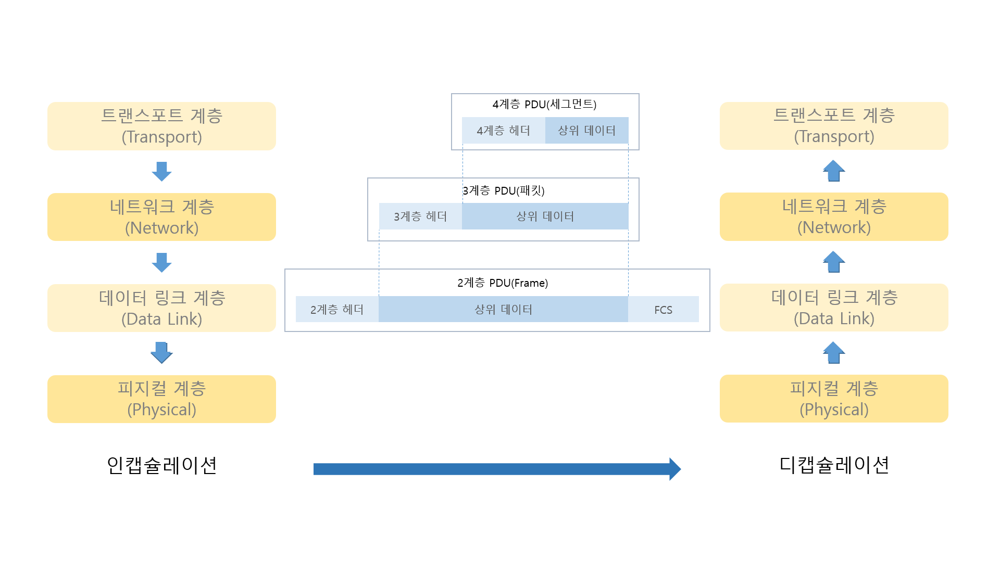

## [서론](#서론)
- [네트워크 구조](#network-architecture)
- [프로토콜](#protocol)
## [OSI 7Layers](#osi-7layers)
- [서론](#서론-1)
	- [\[Network service\]](#network-service)
	- [\[Network Architecture\]](#network-architecture)
	- [\[Protocol\]](#protocol)
	- [\[OSI 7Layers\]](#osi-7layers-1)
		- [\[Physical Layer\]](#physical-layer)
		- [\[Data Link Layer\]](#data-link-layer)
		- [\[Network Layer\]](#network-layer)
		- [\[Transport Layer\]](#transport-layer)
		- [\[Session Layer\]](#session-layer)
		- [\[Presentation Layer\]](#presentation-layer)
		- [\[Application Layer\]](#application-layer)
	- [\[인캡슐레이션 \& 다캡슐레이션\]](#인캡슐레이션--다캡슐레이션-1)
		- [\[MSS \& MTU\]](#mss--mtu)

## [인캡슐레이션 & 다캡슐레이션](#인캡슐레이션--다캡슐레이션)
- [인캡슐레이션](#인캡슐레이션)
- [다캡슐레이션](#다캡슐레이션)
- [MSS & MTU](#mss--mtu)

# 서론

`Network 영역`은 매우 거대하다   
그렇기에 엔지니어, 개발자의 관점으로 나뉘어 공부를 하게된다   
이 책에서는 특정 관점이 아닌 전체적으로 살펴보는 것을 목표로 풀어 나갈 것이다   

들어가기 앞서, 간단하게 기본적인 지식을 알아보자   

## [Network service]

`Network service` 는 크게 `service` 를 제공하거나 받는 입장으로 나뉜다   

## [Network Architecture]

본래 `3-Tier Network Architecture` 가 일반적이었으나   
`scale-out service` 의 등장으로   
`Spine-Leaf Architecture` 으로 변하게 되었다   

[출처](#https://images.app.goo.gl/qFUArcBn9UmWmioG6)

## [Protocol]

`Network` 에서의 규정, 절차를 `Protocol` 이라고 부른다   
각 회사, 협회 등등 각기 다른 `Protocol`을 가지며 이러한 `Protocol` 은 크게 두가지로 나뉘는데   

1. 물리적 -> 데이터 전송 매체, 신호 규약, 회선 규격 등 (Ethernet)
2. 논리적 -> `Protocol` 규격, 장치들끼리 통신하기위한 TCP/IP

로 나뉘며   

`Protocol` 이 생기게 된 개요로는   
처음 `Network` 가 개발된 1900년대의 기술이 열악하여 최대한 적은 데이터를 활용해 프로토콜을 정의 해야 했기에    
대부분 2진수 비트로 만들어졌고 그렇기에 치밀하게 서로간의 약속을 정의해야 했기에 만들어진 것   

하지만 요즘 `Application` 레벨의 `Protocol` 은 문자 기반이 많이 사용되고 있다   
*ex)* HTTP, SMTP...

`TCP/IP Protocol` 은 `TCP/IP Protocol Stack` 이라고 하는데   
해당 Stack 은 크게 `4가지`로 나뉘며 그 안에 여러가지 `Application Layer Protocol` 들이 존재한다    

네트워크를 잘 이해하기 위해서는 TCP/IP Protocol Stack 외에도 OSI 7계층 또한 알아야 한다   

[출처](#https://images.app.goo.gl/F2LKwvU9yhvUCTt89)

## [OSI 7Layers]

[출처](#https://images.app.goo.gl/CjcEPchh8erpb8vF8)

이렇게 7계층으로 데이터 전송과정을 나눈 이유와 장점은 다음과 같다    
1. 데이터 흐름을 한눈에 알아보기 쉽게하기 위함   
2. 이상이 생겼을 때 다른 장비 및 소프트웨어를 건들이지 않고 이상이 생긴 단계만 고칠수 있다     

### [Physical Layer]

`Physical Layer` 은 말 그대로 물리적인 `device` 들이 들어가 있다   

### [Data Link Layer]

1계층 `Physical Layer` 에서는 전기신호만 보내면 되지만   
2계층인 `Data Link Layer` 에서는 출발 지점과 도착 지점의 주소를 확인 해야 한다 (`Data Flow`)   
또한 주소체계가 생기면서 여러 통신이 한꺼번에 이루어지는 것을 구분하는 기능도 정의된다   
전기 신호를 모아 데이터 형태로 처리하기에 데이터에 대한 에러를 탐지 및 복구 할 수 있다   

`frame` 단위로 데이터를 전송하며 대략적인 작동방식은 다음과 같다   

구성 요소로는 `NIC`, `SWITCH` 가 있다   

### [Network Layer]
IP 와 같은 논리적 주소가 정의되는 계층   
데이터 통신을 위해서는 2가지 주소가 사용되는데 2계층의 `MAC`, 3계층의 `IP` 가 사용된다   
`IP` 는 `MAC` 과는 달리 환경에 맞게 변경이 가능하며   
네트워크 주소, 호스트 주소 부분으로 크게 나뉜다   

3계층의 장비나 단말은 네트워크 주소 정보를 이용해   
자신이 속한 네트워크와 원격지 네트워크를 구분한다   
또한 원격지 네트워크 경로를 지정하는 능력이 있다   

장비로는 `Router` 가 있다   

### [Transport Layer]

1, 2, 3 계층에서 전송되고 쪼개고 받은 데이터들을 검증한다   

주로 `Packet Network` 로 전송이 이루어지며   
`Packet Network` 는 보통 데이터를 분할해 전송하기에   
중간에 유실되거나 순서가 바뀌는 경향이 있어 `Transport Layer` 에서는 해당 문제를 바로잡는 역할을 한다   

`Packet` 에 있는 
`Sequence Number`(보내는 순서), `Acknowledgement Number`(받는 순서) 로 데이터가 제대로 전송되었는지 확인 할 수 있고   
`Port number` 를 이용해 `Application` 을 구분한다   

장비로는 `Road Balancer`, `Firewall` 등이 있다   

### [Session Layer]

`end-user-applicaion` 프로세스간의 `session` 을 열고 닫는 기능을 제공   
통신 `session` 은 요청/응답 으로 구성되며   
연결 복구의 기능과 전이중/반이중 작업을 제공한다   
교환된 메시지 스트림에 대해 동기화 지점도 제공한다   

통신단위는 `메시지`로 구성된다   

### [Presentation Layer]

애플리케이션 간의 번역기 역할   
`인코딩`, `암호화`, `합축`, `코드 변환`과 같은 동작

### [Application Layer]

사용자 입출력을 저으이하고 네트워크 소프트웨어의 UI 부분을 정의   

`FTP`, `SMTP`, `HTTP`, `TELNET` 등이 속한다   

## [인캡슐레이션 & 다캡슐레이션]

요즘 대부분 `Packet` 기반 네트워크로 이루어져 있다   

데이터를 전송하면서 각각 계층에 대한 헤더정보들이 전달되며 검증하는 과정을 거친다   

   
인캡슐레이션 - 상위 계층에서 하위 계층으로 데이터를 보내는 과정
다캡슐레이션 - 하위 계층에서 상위 계층으로 데이터를 보내는 과정

### [MSS & MTU]

MSS - Data flow 계층에서 네트워크 상황에 맞게 쪼개는 적절한 데이터의 크기
MTU - 네트워크에서 한번에 보낼 수 있는 데이터의 크기