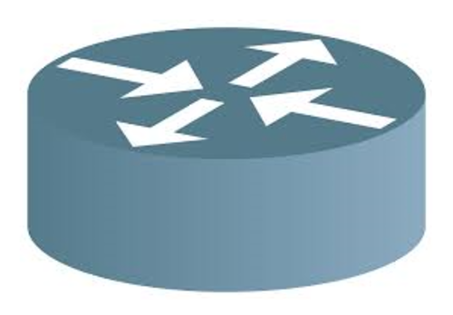
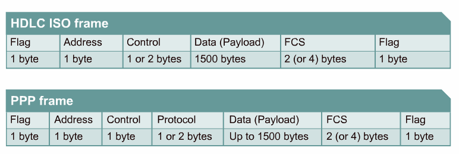

## [라우터](#라우터)
- [\[라우터(Router)\]](#라우터router)
		- [\[브로드캐스트 컨트롤\]](#브로드캐스트-컨트롤)
		- [\[프로토콜 변환\]](#프로토콜-변환)
		- [\[L3 스위치\]](#l3-스위치)
	- [\[동작, 라우팅 테이블\]](#동작-라우팅-테이블)
		- [\[Hop-by-hop\]](#hop-by-hop)
	- [\[라우팅\]](#라우팅)
		- [\[Link State Algorithm\]](#link-state-algorithm)
	- [\[스위칭\]](#스위칭)
	- [\[라우팅, 스위칭 우선순위\]](#라우팅-스위칭-우선순위)
	- [\[라우팅 설정 방법\]](#라우팅-설정-방법)
		- [\[다이렉트 커넥티드\]](#다이렉트-커넥티드)
		- [\[스태틱 라우팅\]](#스태틱-라우팅)
		- [\[다이나믹 라우팅\]](#다이나믹-라우팅)

[최고의 강의](https://www.youtube.com/playlist?list=PLQFHF6cwEgwMu-1mqdSWPcgd-HV4ncz1T)

---


# [라우터(Router)]



각기 독립된 네트워크들을 연결시켜주는 장치   
또는, 네트워크를 분할/구분시켜 연결하는 장치   

이곳에서 설명하는 라우터는 [L3 스위치](#l3-스위치)와 같다   

L3 에서 동작을하며 기본적으로 데이터는 `frame` 을 움직인다   

`Routing & Forwarding` 이라는 작업을 통해 다른 네트워크로 데이터를 전송하는데 `Routing` 과정에서 전달받은 데이터 헤더의 프레임 부분을 떼어내 자신의 `Routing Table` 내에서 해당 정보와 일치하는 부분을 찾은 후 다시 `S(ource)MAC` 의 정보를 새로 넣어주고 `D(estination)MAC` 주소를 `ARP Table` 에서 찾아내어 새로운 프레임 헤더를 붙여주고 `Forwarding` 을 통해 다른 네트워크로 해당 데이터를 전송한다      

### [브로드캐스트 컨트롤]

라우터는 스위치와 다르게 프레임의 도착지 정보를 알지 못하면 통신하지 못하게 한다   
그렇기에 기본동작으로 멀티캐스트 정보를 습득하지않고 브로드캐스트 프레임을 전달하지 않음으로서 다른 네트워크로 전파되는것을 막는 것   

하지만 네트워크에 브로드캐스트가 많이 발생하는 경우 라우터로 네트워크를 분리하여 따로 전용 브로드캐스트 네트워크를 만들어 네트워크 성능을 높일 수 있다   

### [프로토콜 변환]

라우터의 또 다른 역할로 서로 다른 프로토콜로 구성된 네트워크를 연결하는 것   
위의 설명에서 프레임 헤더를 떼고 붙이는 과정에서 서로 다른 종류의 L2 헤더를 떼어내고 붙이면서 다른 프로토콜내에서 통신이 가능하게 해주는 역할도 수행한다   

### [L3 스위치]

라우터 + L2 스위치 라고 보면된다   
이전에는 라우터와 스위치를 분리하여 작동하였으나 패킷의 이동이 많아지면서 라우터와 L2 스위치 의 사이에 패킷이 너무 많이 머무르게되면 성능이 떨어질 수도 있고 이전의 `Router` 는 소프트웨어로 구성되어 있었기에 해당 부분을 하드웨어적으로 구현하게 됨으로써 성능을 높이고 대규모 및 복잡한 네트워크 상에서 사용하기 위해 만들어졌다   

---

## [동작, 라우팅 테이블]

네트워크 상황이 동적으로 변할 수 있기에 들어온 프레임의 정보와 `Routing Table` 의 정보가 일치하지 않을 수 있는데 그럼에도 불구하고 최대한 원하는 목적지에 근접한 정보를 찾아 해당 프레임을 포워딩하게 된다   

### [Hop-by-hop]

데이타통신망에서 각 패킷이 매 노드(또는 라우터)를 건너가는 양상을 비유적으로 표현
IP 주소를 통해 통신하는 과정   

일반적으로 상대방 라우터의 인터페이스 IP 주소를 지정   

상대방의 MAC 주소는 알지만 IP 주소는 모를 때와 같은 특수한 경우에는 나가는 라우터의 인터페이스를 지정   
또한 이러한 경우는 특수한 경우 이므로 상대방 IP 주소를 `NEXT HOP`, 즉 다음 라우터를 도착지 주소로 지정   

1. WAN 구간 전용선에서 [PPP, HLDC](#hldc-ppp) 와 같은 프로토콜을 사용해 상대의 MAC 주소를 알 수 있을 때
2. 프록시 ARP 가 동작해 상대의 정확한 IP 를 알아 낼 수는 없어도 MAC 주소는 알 수 있을 때


인터페이스를 설정 할 때에는 라우터의 나가는 물리 인터페이스를 주로 사용하지만 IP 주소와 인터페이스를 동시에 사용할 때에는 VLAN 인터페이스와 같은 논리적 인터페이스를 사용   


	HDLC, PPP

	HDLC 는 하나의 네트워크에서만 동작하는 프로토콜이기에 범용성이 좁아 효율적이지 않다   
	SISCO 의 경우에는 독립적인 네트워크 계층을 지원하여 다른 회사의 라우터와는 호환이 되지 않는다   

	이렇게 제한 적인 상황에서 사용되는 것이 바로 `PPP` 이다     

	2Layer 에서 호스트나 다른 네트워킹 없이 지점간 연결(Point-To-Point)을 해주는 통신 프로토콜
	캡슐화, 루프 감지 및 데이터 압축 등을 지원한다   
	주로 전화선, 간선, 휴대전화에 많이 사용된다   



	TTL

	패킷의 수명

	두 라우터가 서로 대안 경로를 찾다가 서로를 `Next Hop` 으로 지정이되어 두 라우터 사이에 패킷이 루프에 빠지게 되는데 
	해당 부분을 해결하고자 각 패킷에 수명을 만들어 해당 수명이 다되면 패킷을 버리게 되어 루프를 빠져나올 수 있게 된다   

---

## [라우팅]

복잡한 네트워크를 통해 출발지부터 목적지 까지 데이터를 전송하며 효율적으로 데이터의 흐름을 관리하는 것   

라우터가 경로정보를 얻는 방법에는 3가지가 존재하며 각 방법으로 `Routing Table` 을 만든다   
(이전에는 각 라우터에서 테이블을 생성하였으나 `Control plane` 이라는 추가적인 처리 장치를 중앙에 만듦으로서 각 라우터로부터 정보를 받아와 `Routing Table` 을 만들게 되었다)   

1. 다이렉트 커넥티드
2. 스태틱 라우팅
3. 다이나믹 라우팅

위의 세가지는 아래의 라우팅 설정 방법에서 자세히 다룬다   

### [Link State Algorithm]

라우팅에서 사용되는 핵심 알고리즘   

`Reliable Flooding` 과 `Dijkstra's shortest path` 라는 두 부분으로 구성된다   

[영상](https://www.youtube.com/watch?v=gQtgtKtvRdo)

---

## [스위칭]

패킷이 들어와 `Routing Table` 을 참조하고 최적의 경로를 찾아 외부로 포워딩하는 작업   
일반적으로 2 Layer 에서 동작하나 `Routing` 에서는 3 Layer 에서 동작한다   

패킷을 내보내는데 들어온 패킷의 목적지가 `Routing Table` 과 일치하지 않을 경우    
`LPM` 이라는 `Routing Table` 에서 가장 목적지와 흡사한 항목을 찾아 해당 부분으로 패킷을 내보내게 해주는 매칭 알고리즘을 통해 패킷을 보낸다   
하지만 이러한 작업은 많은 부하가 걸리기에 한 번 스위칭 작업을 수행한 정보는 캐시에 저장하고 그 뒤에 들어오는 패킷은 `Routing Table` 보다 캐시를 먼저 확인하는 동작으로 효율성을 높이는데 주로 출발지와 목적지의 IP, 포트 번호, Next Hop 정보까지 저장한다   

---

## [라우팅, 스위칭 우선순위]

`Routing Table` 은 가장 좋은 경로 정보만 모아놓은 핵심 정보로   
토폴로지 테이블로부터 가져오는 가장 좋은 경로 정보의 기준은 `방법`과 `거리` 가 있다   

목적지 정보가 동일한 서브넷을 사용하는 경우 소스에 따라 가중치를 정하게 되는데,   
이때 가중치를 정하는 기준과 우선순위로는

위의 라우팅 정보 분류와 같은   
1. 다이렉트 커넥티드
2. 스태틱 라우팅
3. 다이나믹 라우팅

로 나뉘는데 필요에 따라 관리자가 우선순위를 조정해 라우팅 경로를 조정할 수 있는데 이러한 우선순위를 `Administrative Distance` 라고 부르며 라우터 생산업체에 따라 해당 `AD` 기준이 조금씩 다르다   

만약 정해놓은 우선순위가 같다면?   
`Cost 값`을 비교해보고 그래도 같다면 `Equal-Cost-Multi-Path` 기능으로 트래픽을 분산시킨다   

요약하자면 라우팅/스위치의 우선순위는 다음과 같다

1. LPM
2. AD
3. Cost
4. ECMP

---

## [라우팅 설정 방법]

### [다이렉트 커넥티드]
```
IP 주소 입력시 사용된 IP 주소와 서브넷 마스크로 해당 IP 주소가 속한 네트워크 주소 정보에 대한 `Routing Table` 을 만드는 것   
위의 테이블은 자동적으로 만들어지며 해당 정보를 강제로 지울 수 없고 해당 네트워크 설정을 삭제하거나 네트워크 인터페이스를 비활성화 해야만 자동으로 사라진다   
```

다이렉트 커넥티드는 외부 네트워크로 나가는 첫 번째 길목으로 해당 정보를 잘못 입력하면 외부 네트워크에 대한 라우팅 정보가 있어도 통신이 불가능하다

주로 IP 주소를 잘못 설정하거나 서브넷 마스크를 정상 범위보다 크거나 작게 설정하면 다이렉트 커넥티드 정보가 잘못 입력되어 통신이 불가능해지는 경우가 존재한다   


### [스태틱 라우팅]
```
모든 경로가 라우터에 수동으로 설정되는 것   
네트워크에 변경 사항이 있어도 누군가 수동으로 바꾸지 않는 한 바뀌지 않는다   
```

가장 효율적인 라우팅 방식으로 `AD` 우선순위를 이용해 다이렉트 커넥티드다음으로 가장높은 우선순위를 가진다   

특징으로는 Next-Hop IP 에 대한 검색과정에서 `Routing Table` 을 재참조하는 Recursive 한 특성이 있다   

대표적인 활용 방식으로는 `Default Routing` 이 존재하는데 이는 `Routing Table` 정보가 존재하지 않는 패킷을 보내는데 사용되는 방식으로 인터넷으로 향하는 경로나 자신에게 경로 정보가 없는 경우 마지막 대체 경로로 사용되며 목적지 주소의 서브넷 마스크가 모두 0인 스태틱 라우터를 `Default Routing` 으로 보면 된다   

### [다이나믹 라우팅]
```
네트워크의 현재 상태에 따라 소프트웨어에 의해 경로가 설정되는 것
링크 실패, 트래픽 변경, 비용 변경과 같은 여러가지 변경 사항으로 인해 매 시간 단계마다 새로운 경로가 설정된다   

라우터끼리 자신이 알고 있는 경로 정보나 링크 상태 정보를 교환하며 전체 네트워크 정보를 학습한다   
```

네트워크가 몇개 없는 간단한 네트워크 구조에서는 관리자가 직접 관리하는 편이 용이하겠으나 그 구조가 커지거나 일반적인 IT 환경을 구축할 때에는 경로에 장애가 생길 경우 대체 경로를 찾아야 하는데 이를 관리자가 매번 확인하여 수동으로 변경해주기에는 너무나 비효율적이고 신속한 대응이 불가능하다   

그렇기에 해당 부분을 해결하기위해 라우터끼리 서로 Neighbor 관계를 맺고 주기적으로 라우팅 프로토콜을 주고받으며 자신의 현재 네트워크 상황을 알려주어 중간 경로에 문제가 생기더라도 대체 경로를 찾는 작업이 자동으로 수행되어 장애에 신속히 대응할 수 있게 되었다   

라우팅 프로토콜은 분류법은 다음과 같다

1. 역할
라우터는 주로  `Autonomous-System` 이라는 자율 시스템으로 관리가 되는데 AS 를 단위로 두어 2개의 라우팅 프로토콜로 나뉜다       
AS 내에서 사용되는 라우팅 프로토콜 - `IGP`   
AS 간 통신에 사용되는 라우팅 프로토콜 = `EGP`    

2. 동작 원리   
인접한 라우터에서 경로 정보를 습득하는 - `디스턴스 벡터`   
라우터에 연결된 링크크 상태를 서로 교환하고 각 네트워크 맵을 그리는 - `링크 스테이트`


최근에는 `BGP` 사용이 늘어나고 있으며 전에 있던 다이나믹 라우팅 프로토콜들은 점점 사라지는 추세이다   

