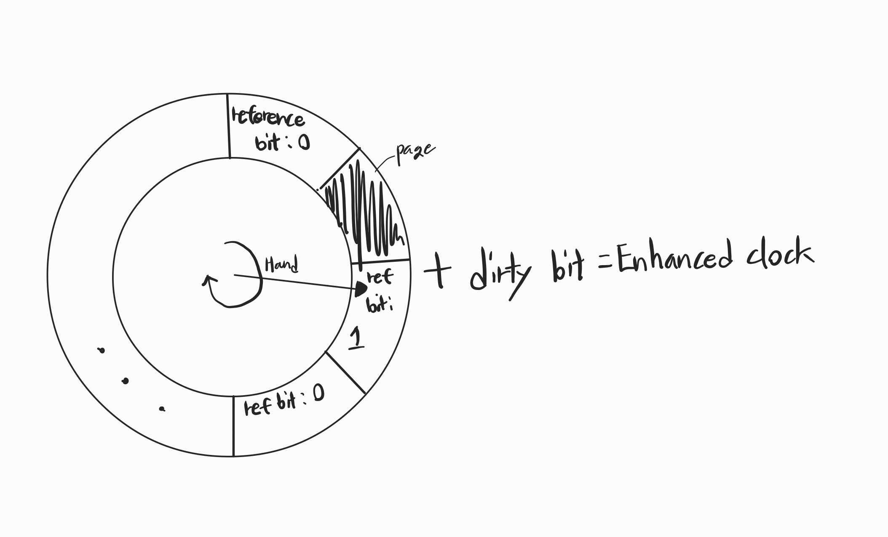

[Background](#background)   
  - [Virtual memory](#virtual-memory)      

[Demand Paging](#demand-paging) 

---

## [Background]

### [Virtual Memory]
---
실제 물리 메모리로부터 사용자 논리 메모리를 분리한 것   

Logical Memory(논리 메모리) 라고도 불리운다   

이러한 논리 주소 공간은 파편화를 막기 위해 Page 단위로 공간을 나누었고   
물리 주소 공간 에서의 `Page` 는 `Frame` 이라고 불리운다   

이 가상주소의 특징은 다음과 같다   

프로그램의 일부만 이 가상 메모리에 올라와 있어도 실행이 가능하며 이로인해 논리 주소 공간이 물리 주소 공간보다 엄청 커질 수 있다
실제 메모리 공간보다 큰 프로그램들이 메모리 영역에서 여러개가 존재를 하게 되며 이는 프로그램이 동시성을 가지고 동작하게 된다   

각 프로세스마다 이러한 논리 주소 공간을 별도로 부여 받으며 특정 메모리 공간은 프로세스끼리 공유하기도 한다   

   

## [Demand Paging]

### [Demand Paging]

Demand - 요구하다

디맨드 페이징은 시스템이 요구할 때마다 페이징을 해주는 방식이라고 보면 된다.   
이로 인해 필요한 페이지들만 메모리에 올라오게 되고, 여러 프로그램들이 동시성을 가지고 실행할 수 있게 된다.

그러나 우리가 필요한 페이지를 가져오고자 했을때, 필요한 메모리가 주 메모리에 있는지 아니면 보조 기억 장치에 있는지 어떻게 판별하는가?   
이는 하드웨어의 도움을 받아 각 페이지 테이블 엔트리마다 1비트를 연결하여 해당 페이지가 주 메모리에 있는지 없는지를 확인하는 '유효-무효 비트(Valid-Invalid bit)'를 이용한다.

   

이렇게 해당 비트가 유효하면 페이지를 가져오고 무효하다면 [Page Fault](#page-fault-handling) 가 발생하게 된다

이러한 디맨드 페이징에 대해 여러가지 양상들이 존재하는데 그중 대표적인 3가지가 있다   

1. Pure Page Fault   
  컴퓨터를 처음 켰을때 메모리에는 아무것도 없다   
  그 상황에서 프로그램을 실행시켰을때 처음부터 대부분의 작업까지는 무조건 Page Fault가 발생하게된다   
2. Locality of reference   
  명령어 add A, B, C 를 실행한다고 했을 때, A B C 각각 모두 서로 다른 페이지에 존재한다고 하면 3개의 Page Fault 가 발생할 수 있는데 이는 다행이도 locality 덕분에 이러한 끔찍한 일은 거의 발생하지 않는다   
3. H/W 의 지원   
  바로 위에서의 유효-무효 비트와 같은 H/W 단계에서의 지원이 필요하며 swap을 위한 메모리공간 및 멈추었던 명령어의 재시작에 관련한 H/W의 지원이 필요하다    
  그 이유는 단순하게 성능측면에서 보았을때 S/W에서 처리하는 것 보다 H/W 에서 처리를 하였을 때 그 성능이 월등이 좋으면서 이와 같은 Demand Paging의 경우에는 구현자체에도 어려움이 있어 H/W의 지원을 받는것이 더 바람직하다   

---

### [Page Fault Handling]

Page Fault 를 처리하는 순서는 다음과 같다   

1. 명령어가 페이지 테이블을 참조함   
2. Valid-Invalid bit == Invalid - trap 발생, 명령어 중지   
3. 운영체제가 trap 감지   
4. 페이지가 backing store에 있는 것을 확인   
   - 페이지가 backing store에도 존재하지 않으면 OS는 `segment fault`와 같은 오류 메시지를 반환   
5. 빈 프레임을 찾아서 swap   
   - 빈 프레임이 존재하지 않는다면 [page replacement](#page-replacement) 실행      
6. 페이지 테이블을 갱신   
7. [명령어 재시작](#restart-instruction)   

---

### [Page Replacement]

비어있는 프레임이 없는데 추가적인 페이지가 필요하다면?     
생각을 해보자, 6개의 프로세스와 40개의 프레임이 있는 상황에서 각 프로세스가 5개의 페이지로만 잘 돌아가다가 갑자기 10개의 페이지가 필요하게된다면 전체적인 페이지가 부족해지는 현상이 발생한다   

이러한 경우 메모리에 올라와 있는 페이지와  backing store에 있는 페이지간의 교체가 필요하다

1. victim 을 선택한다
2. victim 제거(page out)   
   1. victim의 [dirty bit](#dirty-bit)가 dirty하다면 backing store에 write   
3. 필요한 페이지를 backing store로부터 가져온다(page in)   
4. 페이지 테이블을 갱신시킨다   

여기서 우리가 당연히 가져야하는 질문은 `페이지 교체를 할 때, victim은 어떻게 정해지는가?` 이다   

victim을 정하는 알고리즘은 대표적으로 4가지 정도가 있다   

1. [FIFO](#fifo)   
2. [Optimize](#optimize)   
3. [LRU](#lru)   
4. [Second-Chance](#second-chance)   

#### [FIFO]

먼저 들어오는 순서대로 victim을 정하는 알고리즘   

이 방식은 굉장히 효율이 떨어지는데 심지어 [belady's Anomaly](#beladys-anomaly) 라는 현상까지 발생한다   

*그렇다면 이 방식은 어디에 사용할까?*

FIFO 는 Page buffering이라는 방식에 사용 된다   

이 방식은 다음에 설명할 LRU나 Second-Chance에 새로 추가되는 비트를 할당 할 수 없는 구조에서 사용한다   
항상 빈 프레임 풀(pool)을 계속 유지하여 프레임이 부족할 일을 없게 만든다 이를 버퍼라 한다      
페이지를 새로 읽어들일 때, FIFO 방식을 사용하여 버퍼와 victim을 선택하여 새로운 페이지를 할당하고 victim을 버퍼에 저장한다   
그리고 빈 프레임 풀의 내용을 초기화 하지않고 만약 빈 프레임 목록에 있는 프레임중 하나가 재참조되면 바로 그대로 꺼내서 쓸 수 있게 한다   
(backing store가 유휴상태일 때, dirty한 페이지를 write함)   

#### [Optimize]

참조된 페이지들에 대해 페이지 폴트를 최소화 할 수 있도록 최적화 하는 것   
주어진 참조된 페이지들 정보를 가지고 여기서 나올수 있는 최소한의 페이지 폴트 개수를 구하는 방식으로 당연히 페이지 교체 알고리즘에는 사용이 불가능하다   

대신 이 방식을 가지고 다른 페이지 교체 알고리즘의 성능 척도를 구하는데에 사용한다   

#### [LRU]

가장 오랫동안 참조되지 않은 페이지를 victim으로 정하는 알고리즘

구현 방식에는 2가지가 있다   
1. counter
2. stack

#### [Second-Chance]

**Clock algorithm**   

Clock hand 가 가리키는 패이지의 참조비트가 1이면 0으로 바꾸고 다음페이지를 계속 가리키면서 반복하다가 참조비트가 0인 페이지를 만나면 해당 페이지를 victim으로 선택하는 알고리즘   

이렇게만 본다면 괜찮아 보이는 알고리즘이지만...   
만약 모든 참조비트가 다 1이면? (주메모리가 너무 작아서 page fault가 많은 경우)   
이 클락 알고리즘은 단숨에 FIFO로 변신하게 된다    
그래서 OS에서 clock hand가 얼마나 빨리 돌고있는가를 성능척도에 사용하기도 한다      

**Enhanced clock algorithm**

일반적인 클락 알고리즘에서 dirty bit를 추가한것   

swap device가 유휴한 상태면 dirty bit에 따라서 write를 해주고 clean bit로 재설정 가능하다   
이러한 방식으로 swap I/O를 최소화(감추기) 할 수 있다   

##### [belady's Anomaly]

일반적으로 프레임 수가 높아지면 페이지 폴트가 적어지는 것으로 예상되지만 오히려 페이지 폴트 수가 늘어나는 현상   

### [Thrashing]

CPU 스케줄러(scheduler) 와 메모리 관리(Memory Management) 사이에서 발생하는 괴리   

CPU 사용률(utilization이) 낮으면 추가적인 프로세스들을 투입하는 역할을 CPU 스케줄러가 하는데 문제는 메모리에 상주하는 프로세스들이 너무 많아짐에 따라 페이지 폴트가 많이 발생하게되고 그로인한 문맥교환이나 backing store I/O가 많이 발생함으로서 실행중인 프로세스들이 대부분 대기상태로 들어가면서 CPU사용률이 줄어들게되는데 이를 본 CPU 스케줄러가 추가적인 프로세스들을 투입하게되어 프로세스 수가 너무 과다해지고 처음부터 다시 똑같은 악순환이 발생하게 되는것   

즉 메모리가 overcommitted 된것   

### [Working Set]

어느 시점에 특정 프로세스가 액세스하는 페이지들의 집합 == 프로세스의 locality

*워킹셋을 어디에 사용할까?*

[prepaging](#prepaging)에 사용한다   

워킹셋은 프로그램이 돌아가면서 동시에 계속해서 갱신되는 하나의 프로세스 locality의 집합체로 실제로 컴퓨터 성능이 그리 좋지않던 옛날에는 컴퓨터로 작업을 하다가 점심시간에 밥먹고오면 컴퓨터가 느려지는것을 느낄수 있었다고 한다   

*적절한 워킹셋의 기준을 정하는것이 굉장히 어렵다*

피터데닝이라는 사람이 working set parameter를 고안하였는데, t 시간동안 프로세스가 접근한 페이지들을 working set 이라고 정의했다

그런데 t 시간동안 너무 많거나 적은 페이지가 들어오게된다면?   
그것 또한 문제가 생길 것이다 그렇기에 우리는 시간보다는 조금 다른 기준으로 워킹셋을 정해야한다   

간단하게도 모든 프로세스들이 잘 돌아가면서 스레싱이 발생하지 않는다는 것은 모든 프로세스들이 적절한 워킹셋을 들고 동작하고 있다는 뜻이며 이는 페이지 폴트의 발생 횟수가 적다는 뜻이고 이로인해 OS가 확인할 수 있게 된다   
(local placement가 필요)   

OS가 확인한 페이지 폴트 발생횟수에 따라 메모리를 할당하는 기준은    

    threshold보다 많이 발생시 해당 프로세스에게 더 많은 메모리 할당   
    threshold보다 적게 발생시 해당 프로세스에게 할당된 메모리를 회수   

이렇게 만들어진 워킹셋을 resident set이라고 한다   

#### [restart instruction]

기존에는 인터럽트 발생시에는 중지되었던 명령어 상태를 저장해 두었다가 이어서 실행 시키는데 페이지 폴트가 발생한 명령어의 경우 처음부터 다시 시작한다   

**~~개인적인 의견~~**   

*왜 그럴까?*   

새로 올라온 페이지를 참조하여 현재 저장된 명령어의 단계에 직접 접근하여 필요한 부분의 주소값을 변경 시키는 것 보다는 그냥 명령어를 아예 재시작을 해버리면 그럴 필요없이 재시작한 명령어가 알아서 새로 올라온 페이지를 참조하기 때문에 괜히 실행중이던 명령어가 필요로하는 주소값을 새로 가져온 페이지를 참조하여 가져와 바꾸는 것 보다는 구현, 비용, 복잡성 등과 같은 부분에서 훨씬 효과적이기 때문이다   

#### [Copy on write]

말 그대로 write할 때만 copy를 하는 것   

대표적으로 fork() 를 예시로 들면되는데 fork를 하면 자식프로세스는 새로운 PCB 껍데기와 새로운 pid만 부여받고 대부분은 부모의 엔트리와 동일하다 그렇게 똑같은 주소공간을 공유해서 잘 쓰다가 write 를 해야하는 경우 이 둘의 공간은 달라야 하기 때문에 이를 분리해야 해서 자식프로세스에 새로운 물리 메모리 공간을 할당해 주는 것   

#### [dirty bit]

`modified bit` 라고도 불리우는 이 비트는 메모리 블록과 연관되어 있어 해당 블록이 수정되었는지 여부를 알려준다   
메모리 블록이 교체되거나 제거되는 경우 해당 비트를 참조하여 해당 블록을 backing store에 write할지 여부를 결정한다   

*왜 이런식으로 동작하는가?*  

CPU와 가장 멀리 떨어져있는 second storage에 대한 I/O 비용은 굉장히 비싸다   
이러한 비싼 비용을 최소화 하기위해 꼭 필요할 때만 I/O 작업을 수행하기 위해 만들어졌다   
실제로 이 뒤의 storage & I/O device 쪽을 보면 CPU에 여유가 있을 때 몰래 숨어서 이 I/O 작업을 수행하기도한다   

#### [prepaging]

실제 페이지 요청이 있기전에 액세스될 것으로 보이는 페이지를 미리 예상하여 메모리에 로드하는 것   
메모리에 로드하는 페이지를 예상할 때 해당 페이지의 locality를 고려해 주편 페이지까지 로드해야하는데 이 때 워킹셋을 기반으로 가져온다   
워킹셋이 적절히 설정되어있는 경우, 페이지 폴트의 횟수가 적어지게 된다   
