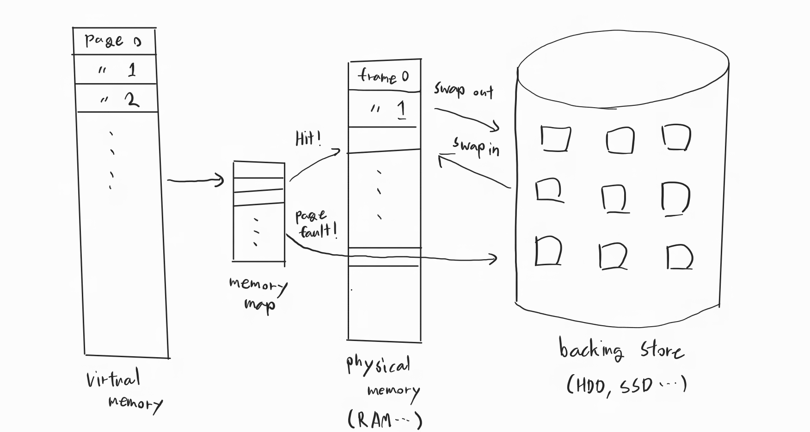
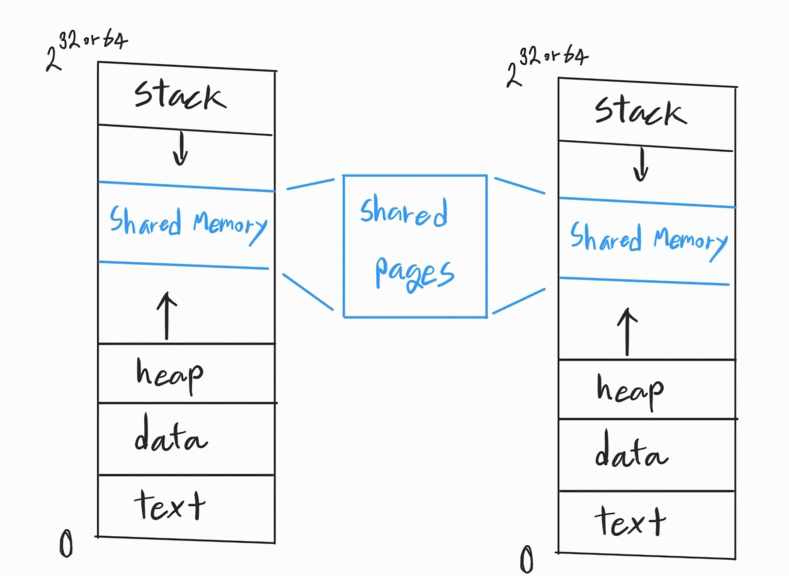
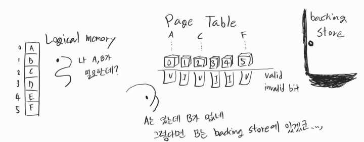

[Background](#background)   
  - [Virtual memory](#virtual-memory)      

[Demand Paging](#demand-paging) 

---

## [Background]

### [Virtual Memory]

실제 물리 메모리로부터 사용자 논리 메모리를 분리한 것   

Logical Memory(논리 메모리) 라고도 불리운다   

이러한 논리 주소 공간은 파편화를 막기 위해 Page 단위로 공간을 나누었고   
물리 주소 공간 에서의 `Page` 는 `Frame` 이라고 불리운다   

이 가상주소의 특징은 다음과 같다   

프로그램의 일부만 이 가상 메모리에 올라와 있어도 실행이 가능하며 이로인해 논리 주소 공간이 물리 주소 공간보다 엄청 커질 수 있다
실제 메모리 공간보다 큰 프로그램들이 메모리 영역에서 여러개가 존재를 하게 되며 이는 프로그램이 동시성을 가지고 동작하게 된다   

   

각 프로세스마다 이러한 논리 주소 공간을 별도로 부여 받으며 특정 메모리 공간은 프로세스끼리 공유하기도 한다   

   

## [Demand Paging]

### [Demand Paging]

Demand - 요구하다

디맨드 페이징은 시스템이 요구할 때마다 페이징을 해주는 방식이라고 보면 된다. 이로 인해 필요한 페이지들만 메모리에 올라오게 되고, 여러 프로그램들이 동시성을 가지고 실행할 수 있게 된다.

그러나 우리가 필요한 페이지를 가져오고자 했을때, 필요한 메모리가 주 메모리에 있는지 아니면 보조 기억 장치에 있는지 어떻게 판별하는가? 이는 하드웨어의 도움을 받아 각 페이지 테이블 엔트리마다 1비트를 연결하여 해당 페이지가 주 메모리에 있는지 없는지를 확인하는 '유효-무효 비트(Valid-Invalid bit)'를 이용한다.

   

### [Page Fault]

### [Thrashing]

### [Working Set]

