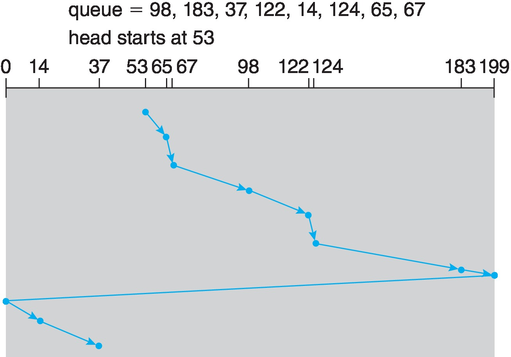

### [Mass-Storage](#mass-storage-1)
  #### [scheduling](#스케줄링-종류)

## [Mass-Storage]

비휘발성의 보조기억장치

HDD or NVM이 있으며 *자기테이프나 광학 디스크, 클라우드 저장소*(이들은 [RAID](#raid)시스템 사용) 등을 사용하기도 한다

우리가 하드디스크로와 원활한 I/O를 하기 위해서는 scheduling이 필요하다

scheduling에는 2가지 가장 큰 목표가 있다
- 접근시간 최소화(seek time)

- 데이터 전송 최대화(bandwidth)

seek time 이란?

- arm 의 헤드가 필요한 섹터의 실린더에 도달하는 시간  

- 또한 플래터가 필요한 섹터쪽으로 돌리는데 걸리는 시간도 포함됨

disk bandwidth(대역폭) 란?

- 전송된 총 바이트 수 / 서비스 요청이 들어오고 끝나는데 걸린 시간

### [스케줄링 종류]

FIFO     
- 선입선출   
   

scan   
- head가 최저 트랙번호(0) 방향으로 이동하는 방식   
   

C-scan
- 기존의 스캔방식에서 한쪽 방향으로만 스캔을 수행하는 방식
- 끝에 도달하면 반대방향으로 가지않고 처음으로 돌아와 다시 한방향으로 스캔을 시작   

## [I/O Systems]

컴퓨터는 수많은 I/O 작업을 수행하고 OS는 I/O를 수행을 제어하고 I/O 장치를 관리한다   

I/O device controller는 모두 버스를 지나고 그 controller들을 OS가 관리한다   

그렇다면 각 device controller들을 어떻게 관리하고 이들에게 data를 전달하는가?

### [Memory-Mapped I/O]

controller는 하나이상의 data 와 control signal들을 받기위한 레지스터가 존재한다   
- data in : 입력 데이터 레지스터(컨트롤러가 처리할 데이터)     
- data out : 출력 데이터 레지스터(컨트롤러가 처리 결과를 외부로 내보낼 데이터)    
- status : 상태 레지스터(e.g. busy, error)     
- control : 제어 레지스터(컨트롤러의 동작을 제어 e.g. init, write, read)   

I/O address에 각 장치들을 mapping 시켜 물리주소에 있는 주소를 통해 정보를 전달하는것   

#### [I/O 종류]

- polling(busy-waiting)   
- interrupt   
- DMA   

#### [Blocking I/O vs Non-blocking I/O] 

Blocking I/O: thread is suspended   

Non-blocking I/O: 기다리지않고 바로 실행됨   

Asynchronous(system call)   

Non-blocking 과 Asynchronous 의 차이   
- read() 호출시   
  - Non-blocking:  
      즉시 return   

  - Asynchronous: 
      호출이 비동기적으로 수행
      실제 읽기 작업이 백그라운드에서 수행되어 완료시 콜백 함수나 이벤트를 통해 프로그램에 알림

#### [Device Drivers]

Device들의 다양한 interface들을 하나의 추상화된 interface로 통일 시키는 것   

block / charactor device로 나뉜다   

charactor device는 좀 작고 사용자와 소통하며

block device는 크지만 cpu보다는 느림 그렇기에 Block Buffer Cache를 이용하여 성능을 보완함   

#### [Device Files]

UNIX 기준 /dev directory에 저장되어 있음
e.g. /dev/tty0

- Major number: device driver의 type을 알려주는 번호   
- Minor number: device driver의 인자, kernel은 신경 쓰지 않는다    

UNIX에서의 Charactor Device driver들은 Array로 정렬되어있으며 이를 Charactor device table 이라고 하며 Index로 Major number를 사용한다   

Block Device driver들도 똑같이 Array로 관리됨   

하지만, 때론 Block Device driver를 Charactor Device driver 처럼 쓰고 싶을 때가 있어서 상부 하부로 나눠서 따로 구현함   

---

#### [Interrupt Handling]

two-level interrupt handling   

interrupt 발생시 기본적으로 자신과 동등한 등급의 인터럽트들을 전부 disable 시킴   
이런 disable하는 작업에 비용을 줄이기위해 two-level을 이용   

첫번째 level 에서는 최소한의 작업만 진행하고
그다음 level 에서 나머지 작업을 수행하는 것   

인터럽트 디스에이블
os에서 해결해야할 필수 작업들 수행   
bottom-half 형태로만들어서 queue에 저장하고 나중에 여유가될때 스케줄링   

동작방식

open
  마이너 넘버 찾아옴
  절절한 디바이스를 초기화
  data structure도 초기화   
  usage counter 증가
  IRQ와 연동시켜서 IVT 에 레지스트

close
  open 의 반대

Read/Write
  여기서 blocking, non-blocking i/o 발생   

---

### [File System]

디스크에 있는 Data를 읽거나 쓸 수 있는 기능을 제공   
File이나 Device와 같은 시스템 자원들에게 Name Space를 제공   

FILE 이란?   
- Second Storage에 저장된 named bytes의 집합       

파일은 사용자에게는 Byte sequence지만 OS에게는 Block sequence로 본다   

파일에 이름을 어떻게 붙여주나?   
Naming   

File Descriptor == Inode   
파일의 내용에 접근하기 위해 필요한 메타데이터들을 저장하는 자료구조   

OS는 이러한 naming한 텍스트 기반의 이름을 int 형식의 FD로 바꿔주는 역할을 한다   

파일디스크립터들을 한곳에 모아두면 bad sector나 seek time의 성능이 저하된다   
옛날에는 모아두엇으나 지금은 가급적이면 data와 근접한곳에 두고 거기에더해 copy를 유지한다   

매번 파일 디스크립터를 읽어오는건 비용이 많이 드니 메인메모리에 copy를 유지하게됨   
이렇게 메인메모리에 유지하는 파일 디스크립터들은 바뀔수도 있기 때문에 디스크에 재구성해야할 필요가 있다   

하지만 이러한 방식은 부팅시 비용이 너무 많기 때문에 log structure file system을 사용한다

Data   
  - Real data: 
  - Meta data: File의 특성을 표현하는 부가적인 Data   

#### [Directory]

왜 Directory가 필요한가?   

파일 이름과 디스크립터 인덱스를 포함한 data content   

UNIX에서는 시작을 root dir에서 시작   

/a/b/c :
  Inode 2: a, 5
  Inode 5: b, 7
  Inode 7: c, 14
  Inode 14: File c

결국 14라는 fd 값을 알려주기위한 매개체로 dir이 사용됨   

여기서는 6번의 디스크 access가 필요하나 buffer cache에 존재한다면 access를 할 필요가 없다   
name parsing 방식임

그래서 그냥 갑자기 전원 내려버리면 파일시스템에 괴리가 생겨서 자꾸 os에서 묻는거임 저번작업 작살나서 뭐가 안되었다고   

#### [Link]

symbolic link
  바로가기
  new name, path 복사
  유연함

hard link
  name, Inode 복사
  그렇지 못함

Inode는 각 storage 볼륨단위로 unique하기 때문에 Inode가 같더라도 동일한 파일임을 보장할 수 없기에 symbolic 링크가 좀더 유연하고 안전하다   

### [File Structure]

storage에 data와 프로그램들을 논리적으로 다루는 시스템

#### [Access]

sequential access
random access
keyed access (Application 단에서 사용되는 방식임 OS는 신경 안씀)

disk 는 page, frame이아니라 block 단위로 저장   

1. Linked
  sequential access는 괜찮은데 random access에서 너무 오래걸림
2. Indexed
  fd에다가 이어져있는 block들에 대한 인덱스값들이 있는 indexed file을 만듬 bad sector에 취약
  그리고 파일의 크기가 인덱스 개수만큼 제한됨

Inode의 형태는 포인터가ㅣ 포인터를 가리키며 그 크기가 점점 커질수 있으며
Inode -> double indirect -> triple indirect -> ... indirect -> indirect block 
의 형태를 지님   

추가적인 매커니즘들   

Buffer cache   
tracking free blocks(bit map) 

directory structure

파일시스템도 사실 여러 레벨로 구현됨   

[Allocation]

파일들을 넣어둘 공간을 어떻게 할당해줄건가?
효율적으로, 빠르게 접근할 수 있도록

Contiguous: 연속적으로 할당   
Linked: 따로 떨어진 블록들을 서로가 각자 다음 블록을 가리킴   
    영화를 중간부터 보고싶을때 뒷부분을 디스크에서 찾으려면 결국 모든 블록들을 순차적으로 읽을수밖에 없음   
    대표적으로 FAT(File Allocation Table)방식이 있음   
    FAT는 위의 방법에 추가적으로 각 노드들의 인덱스들을 모아놓은 놈이 따로 있음   
Indexed: 한놈이 다른 블록들의 모든 위치를 인덱스로 가짐(인덱스 블록)   
    얘는 FAT가아님 Linked + Indexed 가 FAT인 거임    
    문제는 하드디스크에 bad sector가 발생하는 경우를 방지하기 위해 만들어짐   

인덱스 블록을 이용해서 과학수사대의 포렌식 전문가가 범죄자들 하드디스크 복구하는 거임   

Allocation 했으면 free 하는것도 해야한다

Free-Space Management   

free space들을 Linked list로 관리   

### [용어 정리]

#### [RAID]

드라이브의 병렬 수행 - 스트라이핑   
신뢰성 향상 - 중복성, 이를 미러링이라고도함   

parity bit를 이용한 에러를 감지하거나 복구할수 있다

RAID 0 ~ 6 까지있다

자세한 설명은 [여기](https://ko.wikipedia.org/wiki/RAID)에 있다

#### [Boot Block]

리눅스 파일 시스템의 구조는 Boot block에서 시작되며 이곳에는 컴퓨터 시스템을 부팅하기위한 그와 관련된 디스크 이미지를 가지고 있다

리눅스 OS가 실행되면 second storge로부터 boot block을 모두 읽어 main memory에 올려놓고 부팅이 시작된다

