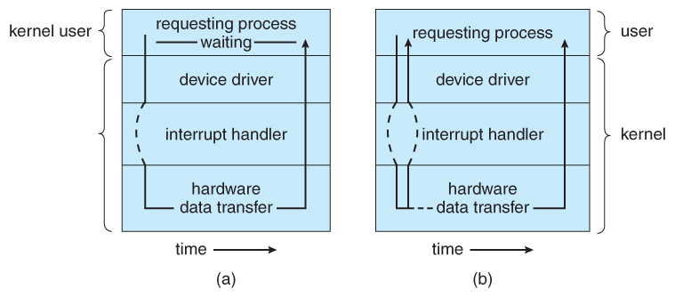

- [\[Mass-Storage\]](#mass-storage)
  - [\[스케줄링 종류\]](#스케줄링-종류)
- [\[I/O Systems\]](#io-systems)
  - [\[Memory-Mapped I/O\]](#memory-mapped-io)
  - [\[I/O 종류\]](#io-종류)
  - [\[I/O interface\]](#io-interface)
    - [\[Device Drivers\]](#device-drivers)
    - [\[Blocking I/O vs Non-blocking I/O\]](#blocking-io-vs-non-blocking-io)
- [\[File Structure\]](#file-structure)
  - [\[Access\]](#access)
  - [\[Allocation\]](#allocation)
  - [\[용어 정리\]](#용어-정리)
    - [\[RAID\]](#raid)
    - [\[Boot Block\]](#boot-block)
    - [\[Device Files\]](#device-files)
    - [\[Link\]](#link)

## [Mass-Storage]

비휘발성의 보조기억장치

HDD or NVM이 있으며 *자기테이프나 광학 디스크, 클라우드 저장소*(이들은 [RAID](#raid)시스템 사용) 등을 사용하기도 한다

우리가 하드디스크로와 원활한 I/O를 하기 위해서는 scheduling이 필요하다

scheduling에는 2가지 가장 큰 목표가 있다
- 접근시간 최소화(seek time)   

- 데이터 전송 최대화(bandwidth)   

seek time 이란?

- arm 의 헤드가 필요한 섹터의 실린더에 도달하는 시간    

- 또한 플래터가 필요한 섹터쪽으로 돌리는데 걸리는 시간도 포함됨   

disk bandwidth(대역폭) 란?

- 전송된 총 바이트 수 / 서비스 요청이 들어오고 끝나는데 걸린 시간   

### [스케줄링 종류]

FIFO     
- 선입선출   
     

scan   
- head가 최저 트랙번호(0) 방향으로 이동하는 방식      
    

C-scan
- 기존의 스캔방식에서 한쪽 방향으로만 스캔을 수행하는 방식   
- 끝에 도달하면 반대방향으로 가지않고 처음으로 돌아와 다시 한방향으로 스캔을 시작      

## [I/O Systems]

컴퓨터는 수많은 I/O 작업을 수행하고 OS는 I/O를 수행을 제어하고 I/O 장치를 관리한다   

I/O device controller는 모두 버스를 지나고 그 controller들을 OS가 관리한다   

그렇다면 각 device controller들을 어떻게 관리하고 이들에게 data를 전달하는가?

### [Memory-Mapped I/O]

controller는 하나이상의 data 와 control signal들을 받기위한 레지스터가 존재한다   

- data in : 입력 데이터 레지스터(컨트롤러가 처리할 데이터)      
- data out : 출력 데이터 레지스터(컨트롤러가 처리 결과를 외부로 내보낼 데이터)     
- status : 상태 레지스터(e.g. busy, error)     
- control : 제어 레지스터(컨트롤러의 동작을 제어 e.g. init, write, read)   

이렇게 프로세서 주소 공간의 특정 부분이 장치에 매핑되어, 해당 메모리 영역에서 직접 읽고 쓰는 방식으로 통신이 이루어진다   

i.e. I/O address에 각 장치들을 mapping 시켜 물리주소에 있는 주소를 통해 정보를 전달하는것   

이렇게 통신하는 수단을 알았다면 방식을 알아야 하지 않겠는가?

---

### [I/O 종류]

장치와 통신하는 간단한 수단에는 3가지가 있다

polling(busy-waiting)   
- 장치의 상태를 주기적으로 확인하여 데이터 전송 준비를 확인하는 기법   
- 매번 장치가 준비되었는지 주기적으로 확인하는 과정에서 CPU자원을 사용하므로 꽤나 비효율적   

interrupt    
- 장치가 독자적으로 동작하다가 데이터 전송 준비가 완료되면 OS에 인터럽트 신호를 보내는 기법   
- OS가 인터럽트를 받으면 현재 작업을 중단하고 ISR을 실행
- polling보다 효율적이다   

DMA(Direct Memory Access)     
- 장치가 CPU의 도움없이 직접 메모리에 데이터를 전송할 수 있게 하는 기법   
- CPU가 DMA 컨트롤러에 데이터 전송 명령을 내리고, DMA 컨트롤러가 데이터를 전송한다(이 때, 데이터 보호를 위해 CPU는 PCI버스에 접근 할 수 없다)      
- 물리적 주소에 매핑된 가상 주소로 접근할 수 있으며 이러한 기법은 DVMA라고 한다   
- 작업속도가 다른 방식에 비해 훨씬 효율적이나 일반적으로 보안상의 이유로 현대 시스템에서는 금지되어있다(커널 전용 작업)   

   

이러한 3가지 기법은 통신에 있어 handshake 기법으로 사용된다

---

### [I/O interface]

#### [Device Drivers]

Device들의 다양한 interface들을 하나의 추상화된 interface로 통일 시키는 것   

크게 block, charactor device로 나뉜다   

- charactor device는 좀 작고 사용자와 소통하며
- block device는 크지만 cpu보다는 느림 그렇기에 Block Buffer Cache를 이용하여 성능을 보완함   

#### [Blocking I/O vs Non-blocking I/O] 

Blocking I/O:   
- I/O request 발생시 진행중이던 프로세스가 대기 큐로 이동   
- I/O 작업이 CPU를 사용하며 그동안 다른 프로세스들은 대기

Non-blocking I/O:   
- I/O request 발생하자마자 바로 I/O request로부터 return 받음   
- 이러한 경우에는 I/O 작업이 완료되었는지 프로세스가 주기적으로 확인을 해야한다

Asynchronous I/O(system call):   
- Non-blocking I/O 에서 polling 방식을 콜백 함수나 이벤트로 바꾸어 프로그램에 알리는 방식   

---

## [File Structure]

storage에 data와 프로그램들을 논리적으로 다루는 시스템

### [Access]

disk 는 page, frame이아니라 block 단위로 저장된다     
블록 단위로 접근하는 방식에 대해 알아보자   

sequential access:   
- 파일 내 정보를 순서대로 접근

direct access:   
- 파일 내 원하는 레코드로 바로 진입해 접근

### [Allocation]

파일들을 넣어둘 공간을 어떻게 할당해줄건가?
효율적으로, 빠르게 접근할 수 있도록   

Contiguous: 
- 연속적으로 할당   
Linked: 
- 따로 떨어진 블록들을 서로가 각자 다음 블록을 가리킨다   
- 영화를 중간부터 보고싶을때 뒷부분을 디스크에서 찾으려면 결국 모든 블록들을 순차적으로 읽을수밖에 없다   
- 대표적으로 FAT(File Allocation Table)방식이 있다(FAT는 위의 방법에 추가적으로 각 노드들의 인덱스들을 모아놓은 블록이 있다)   
Indexed: 
- 한놈이 다른 블록들의 모든 위치를 인덱스로 가짐(인덱스 블록)   
- FAT와는 다르다    
- 하드디스크에 bad sector가 발생하는 경우를 방지하기 위해 만들어졌다   
*인덱스 블록을 이용해서 과학수사대의 포렌식 전문가가 범죄자들 하드디스크 복구하는 거다!*   

free 시에는 Free-Space Management를 사용하는데, free space들을 Linked list로 관리하는 방식이다   

### [용어 정리]

#### [RAID]

드라이브의 병렬 수행 - 스트라이핑   
신뢰성 향상 - 중복성, 이를 미러링이라고도함   

parity bit를 이용한 에러를 감지하거나 복구할수 있다

RAID 0 ~ 6 까지있다

자세한 설명은 [여기](https://ko.wikipedia.org/wiki/RAID)에 있다

#### [Boot Block]

리눅스 파일 시스템의 구조는 Boot block에서 시작되며 이곳에는 컴퓨터 시스템을 부팅하기위한 그와 관련된 디스크 이미지를 가지고 있다

리눅스 OS가 실행되면 second storge로부터 boot block을 모두 읽어 main memory에 올려놓고 부팅이 시작된다

#### [Device Files]

UNIX 기준 /dev directory에 저장되어 있음
e.g. /dev/tty0

- Major number: device driver의 type을 알려주는 번호   
- Minor number: device driver의 인자, kernel은 신경 쓰지 않는다    

UNIX에서의 Charactor Device driver들은 Array로 정렬되어있으며 이를 Charactor device table 이라고 하며 Index로 Major number를 사용한다   

Block Device driver들도 똑같이 Array로 관리됨   

하지만, 때론 Block Device driver를 Charactor Device driver 처럼 쓰고 싶을 때가 있어서 상부 하부로 나눠서 따로 구현함   

#### [Link]

symbolic link:   
- 바로가기   
- new name, path 복사   
- 유연하다   

hard link:   
- name, Inode 복사   

Inode는 각 storage 볼륨단위로 unique하기 때문에 Inode가 같더라도 동일한 파일임을 보장할 수 없기에 symbolic 링크가 좀더 유연하고 안전하다   
