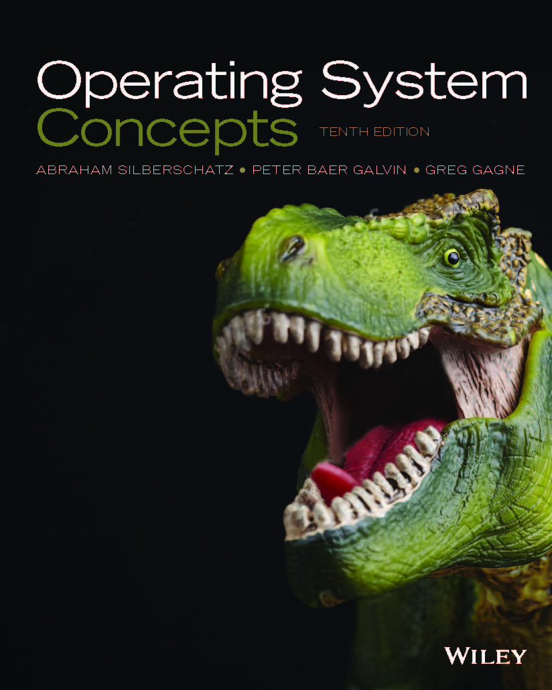

[How to study](#how-to-study)

- [\[How to study\]](#how-to-study)
	- [\[Lecture\]](#lecture)
	- [\[Sources\]](#sources)

## [How to study]

### [Lecture]

`SNUON` 에서 홍성수 교수님의 [운영체제의 기초: 쉽게 배우는 운영체제 원리](https://myetl.snu.ac.kr/courses/244990)  

`Inflearn` 에서 [운영체제 공룡책 강의](https://www.inflearn.com/course/%EC%9A%B4%EC%98%81%EC%B2%B4%EC%A0%9C-%EA%B3%B5%EB%A3%A1%EC%B1%85-%EC%A0%84%EA%B3%B5%EA%B0%95%EC%9D%98)

### [Sources]

- [PDF]   
	- `os-book` 에서의 공룡책 [PDF](https://os-book.com/OS10/index.html)  

