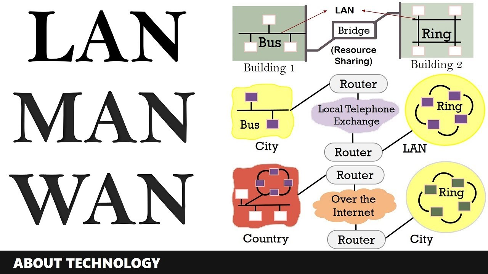
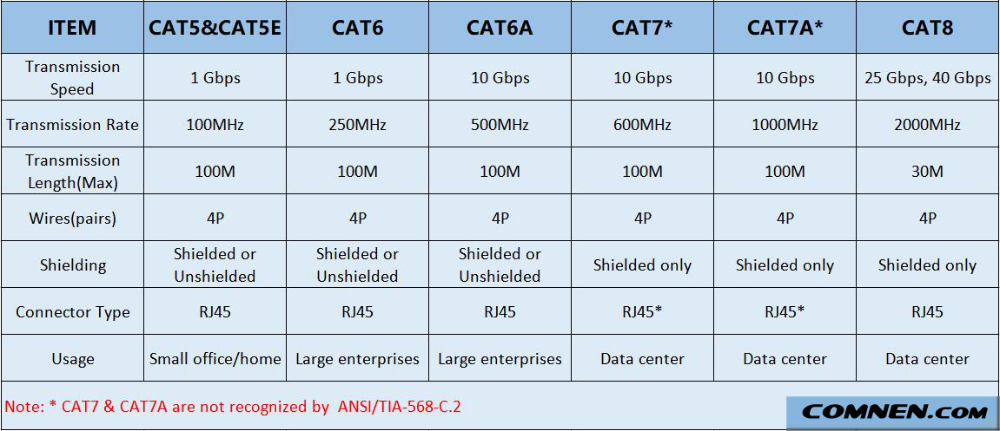

## [네트워크 연결 구분](#네트워크-연결-구분)
- [LAN](#lan-local-area-network)
- [MAN](#man-metro-area-network)
- [WAN](#wan-wide-area-network)
## [네트워크 회선](#네트워크-회선)
- [인터넷 회선](#인터넷-회선)

- [전용회선](#전용-회선)
  - [LLCF](#llcf-link-loss-carry-forward)
  - [인터넷 전용회선](#인터넷-전용-회선)
  - [VPN](#vpn-virtual-private-network)
## [네트워크 구성 요소](#네트워크-구성-요소)
- [NIC](#nic)
- [케이블](#케이블)
- [커넥터](#커넥터)
- [트랜시버](#트랜시버)
- [허브](#허브)
- [스위치](#스위치)
- [라우터](#라우터)
- [로드 밸런서](#로드-밸런서)
- [보안 장비](#보안장비-방화벽)
- [기타](#기타모뎀-공유기-등)

---

# [네트워크 연결 구분]

이전에는 서로 사용하는 기술이 달라서 구분을 했으나 현재는 대부분의 기술이 이더넷으로 통합되어   
네트워크의 규모와 관리 범위에 따라 3가지로 구분된다   

---

[출처](https://www.youtube.com/watch?v=4mq0Nfzc144)

## [LAN (Local Area Network)]
**사용자 내부 네트워크**   

먼 거리를 통신할 필요가 없어 스위치와 같이 비교적 간단한 장비로 연결된 네트워크를 LAN 이라고 불러왔다   
이전에는 소모 비용, 신뢰도, 구축 및 관리를 위한 다른 다양한 기술이 사용되었으나   
현재는 대부분 이더넷 기반 전송 기술을 사용한다   

## [MAN (Metro Area Network)]
**도시 하나를 연결하고 관리하는 네트워크**   

일반적으로 통신사가 이미 갖고 있는 인프라 기반으로 네트워크를 구축하면 WAN, 자체 인프라를 통해 네트워크를 구축하면 MAN 으로 구분한다   

## [WAN (Wide Area Network)]
**멀리 떨어진 LAN 을 연결해주는 네트워크**   

특별한 경우가 아닌 이상, 직접 구축할 수 없는 범위의 네트워크로서 대부분 통신사로부터 회선을 임대해 사용한다   

# [네트워크 회선]

원격지 네트워크에 연결하기 위해서는 WAN 을 사용한다   

일반적인 이더넷 외에 특별한 용도로 음성 회선 기반의 저속 회선 기술이나 통신사업자 간의 고속 통신 또는 가입자를 구분하고 식별하는 용도로 다양한 기술이 사용된다   

## [인터넷 회선]
**인터넷 접속을 위해 통신사와 연결하는 회선**   

속도, 안정성, 비용, 사용 기술에 따라 여러가지 인터넷 회선을 사용
할 수 있다   

- 광 LAN

	광섬유를 주 데이터 링크로 사용하는 네트워크 유형   
	
	고속 데이터 전송, 전자기 간섭에 대한 내성, 높은 보안성으로 인해 대규모 기업 및 기관에서 사용
- FTTH

	현재 사용 가능한 가장 빠른 연결 유형으로 가정과 기업에 
	
	직접 고속 인터넷 서비스를 제공   
- 동축 케이블 인터넷

	케이블 TV 에 사용되는 것과 동일한 유형의 케이블을 사용   
	
	고속 인터넷 연결할 수 있는 가장 일반적인 방법   
- xDSL

	`ADS`, `SDSL`, `VDSL` 과 같은 여러가지 변형된 `DSL` 을 포괄하는 용어   
	
	가장 일반적인 ADSL 은 업스트림보다 다운스트림 방향에서 더 빠른 속도를 제공해, 일반적으로 업로드보다 다운로드가 많은 가정용 사용자에게 적합하다   

## [전용 회선]

가입자와 통신사업자 간에 대역폭을 보장해주는 서비스를 대부분 전용 회선이라 한다   

기존 전화선과 달리 전용 회선은 항상 사용할 수 있으며 음성, 데이터, 비디오를 한번에 모두 전송할 수 있다   

데이터 센터나 대기업과 같은 고속의 안정적인 인터넷 연결이 필요한 곳에서 사용되는데,   
신용카드 처리 또는 원격 모니터링 시스템과 같이 지속적인 통신이 필요한 애플리케이션에도 사용된다   

음성 또는 데이터 중 하나만 사용할 수 있다   

다음과 같은 특징이 있다   
1. 항상 켜져있어서 가능한 지속적인 연결
2. 공유되지 않기에 사용자의 수와는 상관 없는 빠른 속도
3. 업로드, 다운로드 속도가 동일한 대칭 속도
4. 높은 신뢰성
5. 높은 품질의 보안
6. 높은 비용
7. 쉬운 확장

기술에 따른 구분   
- 저속 회선(음성 전송 기술)

	전통적으로 임대 회선을 통한 음성 전송은 `TDM` 기반 기술을 통해 사용되어 왔으나 현재에는 대부분 디지털 기술로 대체되었다   
	
	하지만 아직도 결재 승인과 같은 보안이 필요한 `Clear Text` 전송을 위한 `VAN` 사나 대외 연결에는 저속 회선을 사용하기도 한다   
- 고속 회선(메트로 이더넷)

	MAN 을 통해 대도시 지역에 서비스를 제공하는 이더넷 표준 기반 네트워크   
	
	광케이블 기반의 이더넷을 사용 하며 가입자 트래픽을 고속으로 전송하기위해 여러 가입자를 구분하여 서로 다른 통신 기술을 사용한다   

### [LLCF (Link Loss Carry Forward)]

연결 상태를 감지하고 그에 따라 회선 양쪽 끝에 있는 인터페이스의 상태를 자동으로 업 또는 다운으로 설정할 수 있는 네트워킹 기능   

LLCF 가 활성화된 장치(ex: 라우터, 스위치) 에서 포트 다운 상황이 발생하면 해당 장치에서 클라이언트 신호 실패(CSF) 가 트리거되고 로컬 포트의 Tx(송신)가 다운으로 설정되어   
장애가 발생한 디바이스 방향으로의 전송이 중단된다   

LLCF 의 작동 방식으로는 반대쪽 포트에서 링크 신호를 수신할 때까지 링크 신호를 전송 할 수 없도록 하는 방식으로 작동된다   
따라서 `손실` 의 개념은 링크를 전송하는 관리형 스위치 또는 허브에 이월된다    

### [인터넷 전용 회선]

위의 전용회선과 동일하나 특정 고객 전용으로 사용된다   

다른 가입자와 경쟁하지 않고 통신사와 가입자 간의 연결 품질을 보장해준다   

### [VPN (Virtual Private Network)]

보안이 취약한 네트워크를 통해 안전하고 암호화된 연결을 생성하는 기술   

데이터가 암호화되어 다른 서버를 통해 라우팅되기 때문에 인터넷 연결 속도가 느려질 수 있다   

이러한 VPN 은 일반적으로 통신사 또는 서비스 제공업체가 제공하는 `공급자 VPN` 과 `가입자 VPN` 으로 나뉜다   

1. 공급자 VPN

	타 도시나 해외 연결 전용선 비용이 높은데다 사용 가능한 대역폭을 보장한다고 해서 가입자가 계약된 대역폭을 항상 100% 사용하는 것이 아니라 낭비되는 비용이 클 수 있다   
	이러한 비용 낭비를 줄이기 위해 공급자가 직접 가입자를 구분하여 전용선처럼 사용하는데 대표적인 기술로는 `MPLS VPN` 이 있다   
2. 가입자 VPN

	일반적으로 사용하는 VPN   
	VPN 제공업체에서 구매한 소프트웨어 또는 서비스를 사용하여 자체 VPN 을 설정하고 관리한다   

### [DWDM (Dense Wavelength Division Multiplex)]

기존 고아섬유 백본의 대역폭을 늘리는데 사용되는 광학 기술   

하나의 동일한 광케이블에서 서로 다른 파장의 여러 신호를 동시에 결합하여 전송하는 방식   

# [네트워크 구성 요소]

OSI 7 계층에 소개되었던 네트워크 장치의 동작 방식과 기능   

## [NIC]
**컴퓨터를 네트워크에 연결하기 위한 하드웨어 장치**   

전기 신호를 데이터 신호로 그리고 그 역으로 변환하여 데이터를 송/수신하는데 이러한 변환 작업을 `직렬화` 라고 한다   

랜카드에는 고유의 `MAC 주소`를 가지고 있으며 해당 `MAC 주소`를 통해 `패킷`을 구분한다   

패킷 기반 네트워크에서는 다양한 통신이 하나의 채널을 이용하므로 이미 통신 중인 데이터 처리 때문에 새로운 데이터를 받지 못할 수 있다   
이런 현상으로 인한 데이터 유실을 방지하기 위해 데이터를 받지 못할 때에는 상대방에게 통신 중지를 요청하는데 이 작업을 `흐름 제어` 라고 한다   

일반적인 NIC 외에도 고대역폭, 슈퍼컴퓨터를 위한 HBA 카드나 인피니밴드 카드 등이 존재한다   

## [케이블]

**유선 네트워크 연결을 위한 도구**   

케이블의 종류로는 3가지가 있다   
1. 트위스티드 페어(Twisted Pair)

	가장 흔히 사용하는 케이블   
	컴퓨터에 꽂는 인터넷 선이 바로 이 케이블이다   

	두 선을 서로 꼬아서 서로 간섭에 대한 영향을 줄였다   
	(각 쌍은 1인치당 꼬인 횟수가 서로 다르도록 구성하여 전자기적 간섭을 최소화)

	트위스티드 페어 케이블도 요구되는 속도와 통신 거리에 따라 다양한 스펙이 있어 환경에 따라 적절히 선택해야한다   

	그물 형태의 쉴드가 있는 `STP`   
	포일 형태의 쉴드가 있는 `FTP`   
	쉴드가 없는 `UTP`   
	로 구분이 된다   
	또한 전체 케이블을 보호하는 쉴드의 유무에 따라 `S/FTP` 도 있다   
	

2. 동축(Coaxial)

	외부와의 차폐성이 좋아서 간섭현상이 적다   
	
	전력손실이 적다   

	바다 밑이나 땅 속에 묻어도 성능에 큰 지장이 없다   

	트위스티드 페어에 비해 높은 주파수에서 빠른 데이터 전송이 가능하며 수백 Mbps의 고속 전송도 가능하다   
3. 광(Fiber-optic)

	가는 유리섬유를 이용해 정보를 보낸다   
	일반적으로 다른 구리선보다 신뢰도가 높고 더 먼 거리까지 통신할 수 있어 높은 대역폭이나 먼 거리를 요구하는 
	
	네트워크 장비 간의 통신에 주로 사용된다   
	광신호를 기반으로 하기에 전기적인 간섭을 받지 않으며 전송속도, 대역폭이 뛰어나며 오류가 적다   

	**!)** *레이저가 나오는지 확인할때 눈으로 직접 확인하면 시력에 문제가 생기기에 어둡게하고 손에 비춰봐야한다*

케이블은 각기 상황에 맞는 케이블을 사용해야 하지만 이러한 다양한 케이블들을 모두 알 수는 없기에 케이블을 구성하는 기본요소와 [표준](https://www.ieee802.org/3/)으로 결정한다   

케이블은 물리적으로 `본체`, `커넥터`, `트랜시버`와 같은 여러 요소로 나뉜다    

### [커넥터]

케이블의 끝부분으로 네트워크 장비나 네트워크 카드에 연결되는 부분   

트위스티드 페어 케이블에서는 RJ-45 커넥터를 사용   
광케이블에서는 다양한 커넥터 존재(ex: LC, SC...)   

### [트랜시버]

다양한 외부 신호를 컴퓨터 내부의 전기 신호로 바꾸어준다   

이전에는 트랜시버가 별도로 구분되지 않아 다양한 이더넷 표준과 케이블을 만족하기 위해 네트워크 장비나 NIC 를 별도로 구매해야했고 해당 문제를 해결하고 서로 다른 다양한 네트워크 표준을 혼용해 사용할 수 있도록 트랜시버를 사용한다   

### [DAC (Direct Attach Copper Cable) / AOC(Active Optical Cable)]

트랜시버와 케이블이 하나로 연결된 케이블   
일반적인 데이터 센터 고속 네트워크에서   
`스위치 - 트랜시버 - 광케이블 -트랜시버 - NIC`   
형태로 스위치와 서버를 연결하는데 이더넷 표준은 통신 거리마다 표준이 달라 케이블과 트랜시버를 변경 할 수 있도록 설계되어 있는데 해당 복잡성과 비용을 줄이기 위해 애초에 하나로 묶었다   

그렇기에 두 케이블 모두 끝단에 광 모듈이 연결된 일체형 케이블이라는 점은 같으나 DAC 의 케이블이 동축 케이블인 반면, AOC 는 광케이블 이라는 차이가 있다   

또 다른 케이블들 종류로는

하나의 커넥터에서 여러개의 케이블로 분할해준 `브레이크아웃 케이블` 이 존재하고   
여러개의 선로를 이용해 속도를 높이기위해 케이블 여러개를 한곳에 넣은 고밀도 케이블과 커넥터를 사용하는 `MPO` 케이블 등이 있다   

## [허브]

허브는 케이블과 동일하게 1 계층에서 동작하는 장비이다   
거리가 멀어질수록 줄어드는 전기 신호를 재생성해주고 여러 대의 장비를 연결할 목적으로 사용된다   

하지만 접속된 모든 단말이 경쟁하게되어 다양한 장애가 생기기에 현재는 거의 사용되지 않고 있다   

## [스위치]

허브와 동일하게 여러 장비를 연결하고 통신을 중재하는 2 계층 장비이다   

내부 동작 방식은 허브와 다르나 여러 장비를 연결하고 케이블을 한곳으로 모아주는 역할을 같기에 `허브` 라는 용어를 공통적으로 사용한다   

## [라우터]

3 계층의 장비로서 원격지로 쓸데없는 패킷이 전송되지 않도록 브로드캐스트와 멀티캐스트를 컨트롤하고 불분명한 주소로 통신을 시도할경우 이를 버린다   

정확한 방향으로 패킷이 전송되도록 경로를 지정하고 최적의 경로로 패킷을 `포워딩` 한다   

## [로드 밸런서]

4 계층의 장비로서 애플리케이션을 관리하는 7 계층의 로드 밸런서와는 다르다   

4 계층 포트 주소를 확인하는 동시에 IP 주소를 변경할 수 있어 네트워크 트래픽을 적절하게 분산시켜 서비스 성능을 높여주며 문제가 발생하더라도 빠른 시간안에 서비스가 복구되도록 도와준다   

이러한 특징들로 주로 `웹 서비스` 에 주로 사용된다   

## [보안장비 (방화벽)]

4 계층에서 동작해 방화벽을 통과하는 패킷의 3, 4 계층 정보를 확인하고 정책과 비교해 버리거나 포워딩한다   

## [기타(모뎀, 공유기 등)]

거의 모든 가정이나 회사에서 사용하는 공유기는 LAN 포트와 WAN
포트는 모두 일반 이더넷이어서 먼 거리를 통신하기 위해서는   
짧은 거리와 먼 거리를 통신할 수 있는 기술이 다른 것을 변환해주는 모뎀을 필요로 한다   

[출처](https://www.slideserve.com/ferris/data-communications)

## [출처]
[네트워크 이론](https://easyitwanner.tistory.com/392#2)