# [유니캐스트, 멀티캐스트, 브로드캐스트, 애니캐스트]

## [유니캐스트(Unicast)]   
	1:1 통신   
	출발지와 목적지가 1:1 로 통신

	IP : 192.168.0.xx --> 192.168.0.xx 로 통신하는 것   

## [브로드캐스트(Broadcast)]   
	1:모든통신   
	동일 네트워크에 존재는 모든 호스트가 목적지

	IP : 192.168.0.xx --> 192.168.0.255 (2 진수로 11111111) 로 모든 대역폭에 전송   
	기본적으로 NIC 가 전기신호를 수신할 때 송신을 하지 못하므로 어느정도 지연이 일어나게된다   
	그렇기에 최대한 자제하여 사용하는 것이 좋다    

## [멀티캐스트(Multicast)]   
	1:그룹(멀티캐스트 구독 호스트) 통신
	하나의 출발지에서 다수의 특정 목적지로 데이터 전송

	인터넷 방송을 생각하면 되는데 시청자들을 하나의 그룹으로 묶어   
	그룹에 해당되는 사람들에게만 브로드캐스트를 하는 것   
	(실제로 2L에서 브로드캐스트로 처리된다)

	IPTV(IGMP) 에 사용되는 기술이다   

## [애니캐스트(Anycast)]   
	1:1 통신(목적지는 동일 그룹내의 1개 호스트)
	다수의 동일 그룹 중 가장 가까운 호스트에서 응답
	IPv4 에서는 일부 기능 구현, IPv6 은 모두 구현 가능   

	브로드캐스트, 멀티캐스트와 같이 여러 네트워크에 전송하는 부분에 있어 생기는 비효율을 처리하기 위해 `SDN` 이라는 기술이 있으며 해당 기술에 적용되는 방식이다     

	대표적인 방식으로는 구글의 DNS 주소인 `8.8.8.8` 을 통해 가장 가까운 호스트와 연결하는 방식이 있다   

		BGP : 
			AS 간의 라우팅을 지원하여 최선의 PATH 를 찾는 인터넷 자율 시스템
			즉, 가장 짧은 AS-PATH 를 찾으려고 하는 프로토콜로 네트워크를 최적화 해준다
			
[BGP_PDF](./자료/Netmanias.2010.07.10_BGP_Protocol_Overview.pdf)   
[BGP_AWS](https://aws.amazon.com/ko/what-is/border-gateway-protocol/)   

**이러한 통신 방식들은 실제 데이터를 보내는 목적지를 기준으로 구분한다**

### [BUM 트래픽]

`Broad`, `UnknownUni`, `Multi` 캐스트를 합친 말로 실질적인 동작이 브로드 캐스트와 같을 때를 가리킨다   
위에서 말했듯이 이러한 브로드캐스트 방식은 쓸데없이 네트워크 자원을 소모하기 때문에 네트워크 성능 저하를 불러 일으켜 문제가 생긴다   

이더넷 환경에서는 ARP 브로드캐스트를 먼저 보내고 통신을 시작해 `BUM` 트래픽이 많이 발생하지 않는다고 한다   

# [MAC 주소]

MAC 주소는 Media Access Control 의 줄임말로 2L 에서 통신을 위해 네트워크 인터페이스에 할당된 고유 식별자   

`48비트`, `16진수`, `12자리` 로 표현이되며    
앞의 6자리는 IEEE 가 제조사에 할당하는 부분이고(Organizational Unique Identifier)    
뒤의 6자리는 각 제조사에서 네트워크 구성 요소에 할당하는 부분이다(Universally Administered Address)   

	MAC 주소는 절대적인가?
		흔히 MAC 주소는 유일한 값이라고 생각하지만 꼭 그렇지는 않다   
		물리적인 부분에서는 제조사에서 그냥 아무렇게나 찍어버릴수도 있고   
		논리적 부분에서는 이 MAC 주소도 결국 메모리에 적재되어 구동되므로 여러가지 방법을 통해 변경할 수 있다
		또한 윈도우나 핸드폰의 경우 MAC 주소를 손쉽게 변환할 수 있는데다 하나의 단말에 여러가지 NIC 를 가질 수 있으므로 단말이 아닌 NIC 에 종속되는 MAC 주소의 특성상 몇몇 복잡한 네트워크 장비는 NIC 와 MAC 주소가 여러개 할당 되기도 한다   

동작 방식으로는   
MAC 주소를 가지고 있는 NIC 에서 전기 신호가 들어오면 2L에서 패킷 형태로 변환하여 내용을 구분한 후,   
도착지 MAC 주소를 확인하여 그 주소가 맞으면 상위 계층으로 넘겨주고 맞지 않으면 폐기한다   

특이 케이스의 경우로 본인의 주소나 브로드캐스트 주소는 NIC 자체적으로 패킷을 처리하지 않고 OS 나 애플리케이션에서 처리해야 하므로 시스템에 부하가 작용한다   

### [무차별 모드(Promiscuous Mode)]

다른 목적지를 가진 패킷을 분석 할 수 있도록 하는 모드   
대표적으로  `Wireshark` 라는 패킷 분석 애플리케이션이 있다   

# [IP 주소]

OSI 7 계층 중 주소를 갖는 Layer는 2L, 3L 둘 뿐이다   
그중 논리 주소인 IP 주소는 3L 에서 사용된다   

대부분의 네트워크가 `TCP/IP` 로 작동하기에 IP 주소 체계를 이애하는것이 좋다   

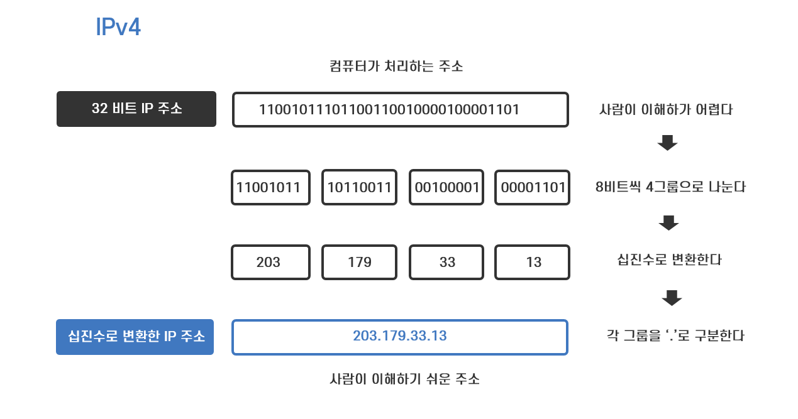   

각각 8 비트씩 `옥텟` 이라고 하며 총 4개의 옥텟으로 구성되어있다   

크게 네트워크 주소와 호스트 주소로 나뉘는데 이 둘을 구분하기 위해 `서브넷 마스크` 라는 구분자로 구분한다   
        
## [클래스 IP(클래스풀)]

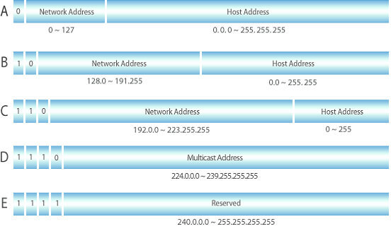

IP 를 부여할때 고정된 비트 수 만큼 네트워크 번호를 부여해주고 나머지 남은 비트가 호스트 주소가 되는데 해당 비트로 만들 수 있는 경우의 개수가 만들 수 있는 호스트 개수 와 같다   
호스트 개수를 위의 방식으로 크기를 정해 줘서 IP 주소를 부여하기위해 만든것이 클래스 IP 이다   

A, B, C, D, E 클래스가 존재하며 D, E 클래스는 멀티캐스트, Reserved for futures 로 나뉘며 나머지 A, B, C 클래스는 각기    
첫 번째, 두 번째, 세 번째 까지의 주소가 네트워크 주소,    
그 외에는 호스트 이며 구분 방법으로는    
`첫 옥텟 2 진수 8 자리`부터    
A : 0(001. ~ 126.xxx.xxx.xxx)   
B : 10(128 ~ 191.xxx.xxx.xxx)   
C : 110(192 ~ 223.xxx.xxx.xxx) 으로 나뉘어 있다   

(멀티캐스트의 경우 1110 이 부여된다)      

이렇게 확장성과 효율성을 모두 잡아주었던 클래스 IP 체계를 `클래스풀` 이라고 부른다   

## [클래스리스 IP]

인터넷이 확장되며 사용자가 기하급수적으로 늘어남과 동시에 클래스풀 주소 체계로 부여 할 수 있는 IP 숫자가 터무니 없이 적었고 그와 동시에 낭비되는 IP 숫자가 늘어나면서 여러가지 대책들이 생겨났는데, 그중 첫번 째 단기 대책으로서 클래스리스 네트워크가 등장하게 되었다   

현재 사용중인 주소 체계는 클래스 개념을 적용하지 않는 클래스리스 기바 주소 체계이다   

첫 번째 옥텟의 앞 숫자를 보고 클래스를 확인한 후 어디까지가 네트워크 주소인지 확인했다면 클래스리스 주소체계에서는 `서브넷 마스크` 라는 이 별도의 구분자를 사용한다   

### [서브넷 마스크]

서브넷마스크도 클래스풀 주소 체계와 같이 일반적으로 사용되는 기본 서브넷 마스크가 존재하는데 A, B, C 클래스로 나뉜다   
A : 255.0.0.0   
B : 255.255.0.0   
C : 255.255.255.0   

이 서브넷마스크는 대표적으로 쓰일 뿐이지 서브넷마스크가 정해져있지는 않다   

서브넷 마스크와 IP 주소의 `AND 연산` 을 통해 얻어지는 주소가 네트워크 주소이다   

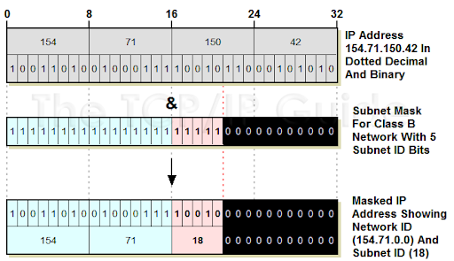   
[출처](http://www.tcpipguide.com/free/t_IPSubnetMasksNotationandSubnetCalculations-3.htm)   

### [서브네팅(VLSM)]

VLSM(Variable Length Subnet Masking) 은 가변길이 서브넷 마스크로 기존 서브넷 주소 지정 체계를 좀 더 세밀하게 향상시키기 위해 등장한 주소 지정 체계이다   

서브넷 마스크의 표기법으로는 기존에 있는 IP 주소의 4번째 옥텟에 /24, /16 과 같은 기호를 붙이는데 이는 앞에서부터 24개의 비트가 사용된 서브넷 마스크를 사용 했다는 뜻으로 255.255.255.0 이라는 서브넷 마스크가 구분자로 들어갔음을 알 수 있다   

회사에서 IP 주소를 분할해야한다고 해보자   
전체 네트워크에서 6개의 부서에 주소를 분할해 줘야 한다고 가정했을 때, 클래스 C 네트워크(201.45.222.0/24) 를 갖춘 회사의 경우 남은 호스트 비트는 8개, 6개의 부서에 나누어 주기 위해서는 서브넷 마스크 ID 를 구분하기 위해 해당 호스트 비트 3개(서브넷 1: 000, 서브넷 2: 001 ...)가 필요하게 되는데 이렇게 되면 사용할 수 있는 호스트 비트가 5개로 각기 30개의 호스트 를 가지게된다   

하지만 어떤 부서는 인원이 6명 뿐일 수도 있고 어떤 부서는 50명이 필요하기에 각 부서에 호스트를 전달 하게 되면 주소가 낭비가 되며 낭비되는 주소를 따로 필요한 부서에 분할해서 지정해주는 방식은 비용 뿐만이 아니라 네트워크가 복잡하게 된다는 단점이 있다   

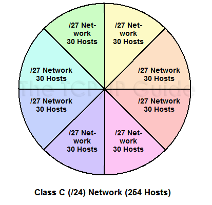      

그렇기에 그에 대한 해결책으로 가변길이 서브넷 마스크를 사용해 조금더 세밀하게 서브넷 마스크의 단위를 나누어 주소를 분할 해 주는 방식이 나왔다   

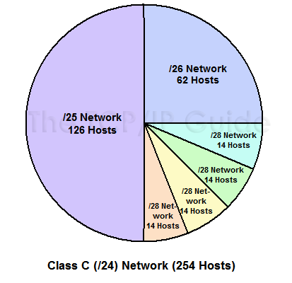     

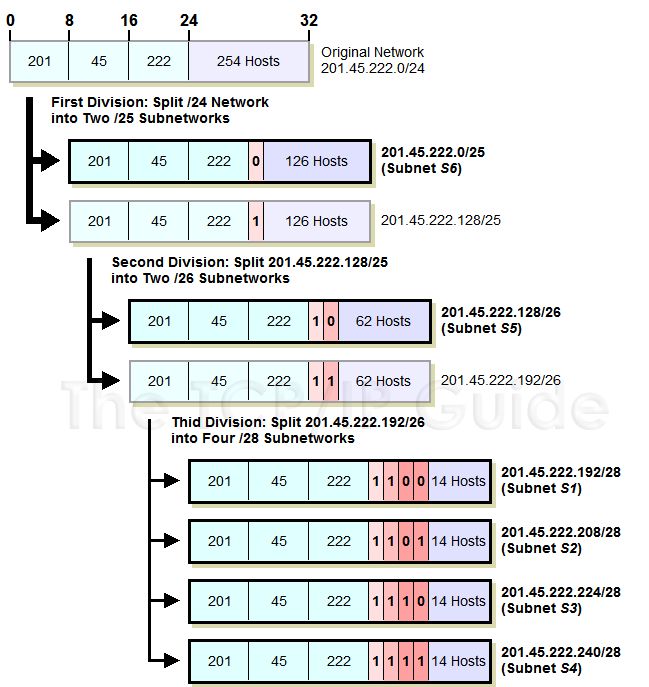   

[출처](http://www.tcpipguide.com/free/t_IPVariableLengthSubnetMaskingVLSM.htm)   

## [공인 IP, 사설 IP]

위와 같은 방식으로 인터넷에 접속하기 위해서는 정당한 IP 할당 기관에 요청해 IP 주소를 새로 얻을 수 있는데 이를 `공인 IP` 라고 하며 인터넷 접속 없이 NAT 기술을 사용하는 경우 IP 를 임의로 할당 해 주는데 이를 `사설 IP` 라고 한다   

사설 IP 로는 인터넷 접속이 불가하나 NAT 장비에서 공인 IP 로 변환해주기 때문에 인터넷에 연결이되는데 이는 주로 가정에서 만힝 사용하는 공유기가 대표적인 예다   

회사 내부에서 사설 네트워크를 구축할 때 NAT 를 사용하여 인터넷에 연결하더라도 다은 사용자에게 할당된 IP를 사설 네트워크 주소로 사용하면 안된다   

A company : 20.0.0.0/24
B company : 30.0.0.20
C company : 40.0.0.40 --사설 IP-> 20.0.0.0/24

위의 회사들 중 C 회사가 A 회사의 공인 IP 주소에 접근 하려고 할 때   
C 회사에서 사설 IP 가 NAT 장비를 통해 C 회사의 공인 IP 주소로 바뀌었다 해도 A 회사의 공인 IP 와 C 회사의 사설 IP 를 같은 네트워크로 인식하므로 A 회사의 주소로 접근 할 수 없다   

#### [Bogon IP]

모든 IP 가 인터넷에서 사용되는 것은 아니고 IP 주소를 할당해주는 최상이 기구은 LANA 가 여러가지 목적으로 예약을 해 놓는 주소   

이러한 Bogon IP 는 인터넷에서 동작하는 라우터에 해당 정보가 존재하기 않기에 해당 Bogon IP 로 통신 시도가 있다면 실수나 해킹의 목적이 있을 수 있으니 적절히 필터링하고 때로는 자기가 실수로 할당되는 경우도 있으므로 한번씩 확인하는 것이 좋다   

# [TCP / UDP]

기존 2, 3L 에서는 목적지에 맞게 데이터를 보내는 것에만 치중되어있다면 목적지에 데이터를 어떻게 정확하게 보내는지에 대한 부분이 이 4L 에 존재하는 프로토콜의 역할이다   

7 Layers 간에 데이터를 전송하는 것을 인플레이션, 디플레이션이 존재하는데 전송하면서 상위 프로토콜 지시자의 번호를 헤더에 추가하게 되는데 4L 에서는 `Port 번호`가 상위 프로토콜 지시자이다   

## [TCP]

신뢰성 있는 데이터 통신을 가능하게 하는 프로토콜   

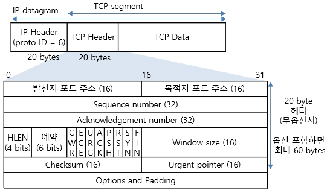    
[출처](http://www.ktword.co.kr/test/view/view.php?m_temp1=1889)   

TCP 플래그로는 총 6가지가 존재하며 통신의 성질을 나타낸다   
	
	SYN : 연결시작 			연결 시작될 때 1로 표기

	ACK : ACK 유효성		유효한 ACK 번호의 경우 1로 표기

	FIN : 연결종료			연결 종료시 1로 표기 (데이터 전송을 마친후 정상적인 양방향 종료시)

	RST : 연결종료			연결 종료시 1로 표기 (연결 강제종료를 위해 일방적으로 연결을 끊을시)

	URG : 긴급 데이터		긴급 데이터인 경유 1로 표기

	PSH : 					서버 측에서 전송할 데이터가 없거나 
							데이터를 버퍼링 없이 응용 프로그램으로 직시 전달할 것을 지시할 때에 사용

전송 단위인 패킷으로 데이터를 분할하여 해당 패킷에 번호를 부여한 것을 ACK 번호라고 한다   
해당 ACK 번호가 제대로 전송, 수신이 이루어졌는지 확인하는 과정을 악수(handshake)라고도 표현하는데 핸드쉐이크 과정이 연결할 때, 연결을 끊을 때로 나뉘어 연결할 때에는 3 way-handshak 를 사용하며 연결을 끊을 때에는 4 way-handshake 를 한다   

### [윈도 사이즈, 슬라이딩 윈도]

송신 측에는 매 프레임에 sequence number 를 매기는데 수신측에서는 매 프레임에 대한 응답으로 ACK 프레임을 회신한다    

하지만 이러한 응답이 패킷 하나당 한번씩 일어난다면 데이터가 커질수록 그 응답수는 비례하게 늘어날것이기에 송신측에서 응답을 받고도 연속하여 전송할 수 있는 연속된 프레임 수를 제한하여 최적화를 한 것이 `슬라이딩 윈도` 라고 하며 해당 크기를 `윈도 사이즈` 라고 한다   

슬라이딩 윈도 프로토콜은 다음과 같다   

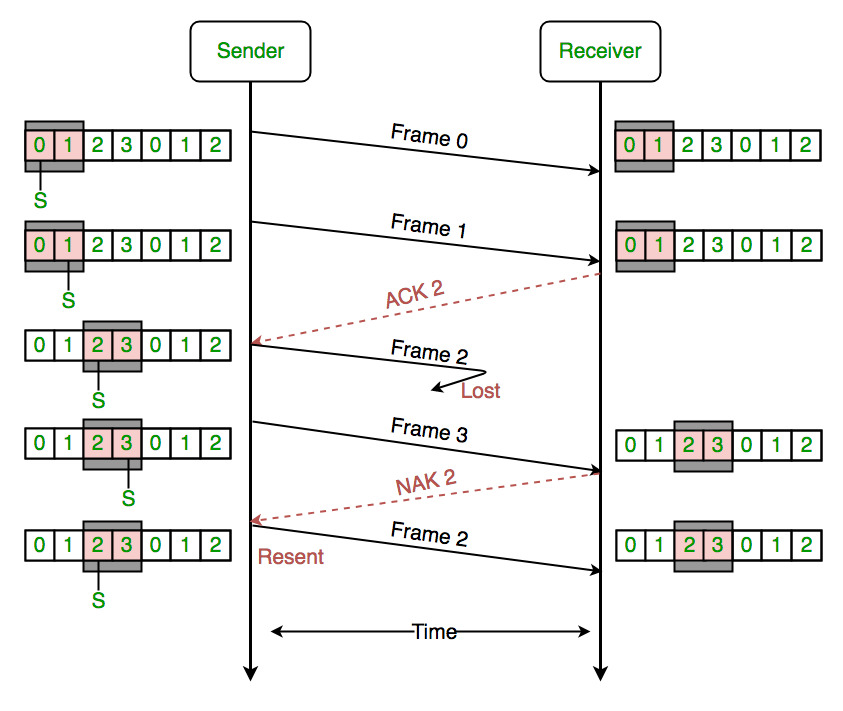   
[출처](https://www.google.com/url?sa=i&url=https%3A%2F%2Fwww.geeksforgeeks.org%2Fsliding-window-protocol-set-3-selective-repeat%2F&psig=AOvVaw3QBbboayCKBzIgm2WYzqn-&ust=1709533305817000&source=images&cd=vfe&opi=89978449&ved=0CBQQjhxqFwoTCOCFn_2514QDFQAAAAAdAAAAABAE)

### [3 way-handshake]

1. 클라이언트가 서버에 접속 요청하는 `SYN 패킷` 을 보내고 `SYN-SENT` 상태가되어 서버의 응답을 기다린다   
2. 서버가 SYN 요청을 받고 `ACK` 와 `SYN-flag` 가 설정된 패킷을 클라이언트에 보내고 `SYN-RECEIVED` 상태가 된다
3. 클라이언트가 패킷을 받고 다시 서버에 패킷을 전달하며 이후로는 서버가 `ESTABLISHED` 상태가되며 연결이 이루어진다     
   
위의 과정들 마다 받는 패킷의 ACK 번호가 맞는지 확인한다   

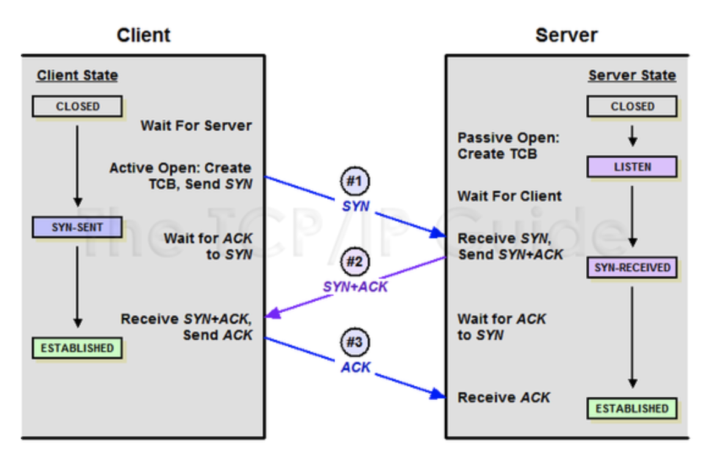   

### [4 way-handshake]

1. 클라이언트에서 연결을 종료한다는 `FIN` 플래그를 전송한다   
2. 서버에서 일단 확인 메세지를 보내고 `TIME-WAIT` 상태가 되어 자신의 통신이 끝날때 까지 기다린다   
3. 서버의 통신이 끝나면 클라이언트에게 연결이 종료되었음을 알리기 위해 `FIN-flag` 를 전달한다   
4. 클라이언트가 확인했다는 메시지를 보낸다   

위의 TIME-WAIT 이 존재하는 이유로는 패킷이 잘못 전달되어 늦게 도착하게되면 데이터 유실이 발생하기에 일정시간동안은 기다리며 잉여 패킷을 받기 위함이다   

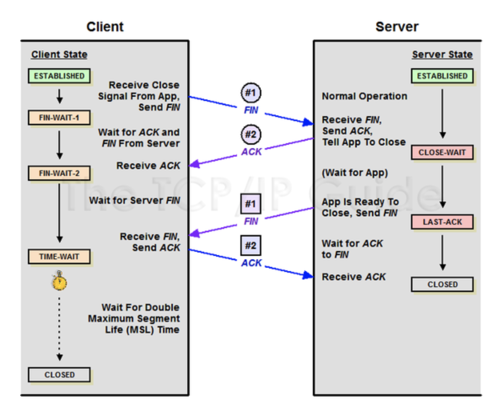   

## [UDP]

특이하게도 4L 프로토콜이 가져햐 할 특징이 거의 없고 TCP 에서 신뢰성을 위한 작업이 없이 데이터가 유실된다 하더라도 그대로 전달한다    

위와 같은 경우로는 실시간 통신에서 주로 사용되는데 주로 화상회의와 같은 사용자가 청각, 시각적으로 응답시간이 민감한 경우 데이터를 다시 재전송 받기보다는 유실된 채로 그대로 내보내는 것이 서비스 적으로 더 좋은 경우에 사용이된다   

넷플릭스나 다른 동영상 스트리밍과 같은 개인 사용자의 경우 데이터를 미리 받아올 수 있어 신뢰성과 응답시간을 맞출 수 있는 경우에 TCP 가 사용이되고 그 외의 실시간 환경에서는 미리 받아올 수 없는 환경이기에 신뢰성을 포기한 UDP 가 사용이 된다고 한다   

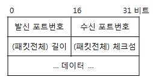      
[출처](http://www.ktword.co.kr/test/view/view.php?m_temp1=323)   

# [ARP]

상대방의 MAC 주소를 알아내기 위한 프로토콜   

데이터 통신을 위해 MAC 주소와 IP 주소가 사용되는데 이 두 주소는 사실 아무런 연관성이 없다   
이러한 두 주소를 연계시켜주기 위한 메커니즘으로 ARP 프로토콜이 사용된다   

그렇다면 왜 연계를 시켜줘야할까?   
그 이유는 단순하다 데이터를 보내기 위해서는 IP 주소만으로는 목적지를 알 수가 없다   
왜냐하면 실질적으로 전기신호로 바뀐 데이터를 받는것은 NIC 이므로 MAC 주소를 알아야한다   
그렇기에 상대방의 MAC 주소를 알아내기위해 1대1 로 두 주소를 매칭해 놓은 ARP table 을 만들어 놓고 보내고자하는 IP 주소등을 담은 ARP query 를 브로드캐스팅을 하여 동일한 IP 주소를 가진 목적지에서 응답을 보내 MAC 주소를 함께 보내주며 해당 MAC 주소를 ARP table 에 저장해 놓고 이후에 해당 ARP table을 이용해 데이터를 전송하게 된다   

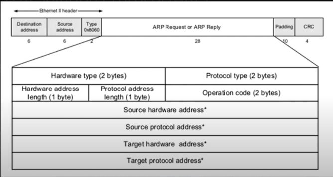     
[출처](https://nexgent.com/what-is-arp-address-resolution-protocol/)   

윈도우 명령 프롬프트에서 `arp -a` 명령어를 치면 1대1 매칭이된 MAC 주소와 IP 주소를 모아놓은 ARP table 을 확인할 수 있다

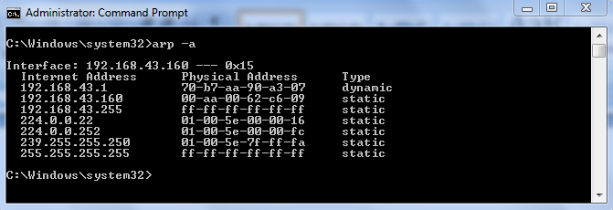   
[출처](https://static.javatpoint.com/tutorial/computer-network/images/arp-table2.png)   

네트워크 장비에서 ARP 작업은 하드웨어 가속으로 처리되지 않고 CPU 에서 직접 수행하므로 짧은 시간에 많은 요청이 들어오면 네트워크 장비에서는 큰 부하로 작동되어 해당 부분을 악용한 공격들이 많았다   
그러한 공격에 대응하기위해 장비의 성능을 높여 저장기능을 높이거나 요청을 필터링하는 방식 등으로 처리한다   

[아주 좋은 유투브 강의](https://www.youtube.com/watch?v=BVjVlA6w5ko)

## [GARP]

GARP 는 대상자 IP 필드에 자신의  IP 주소를 채워 ARP 요청을 보내서 ARP 가 상대방의 MAC 주소를 알아내는것 과는 반대로 상대에게 자신의 IP 와 MAC 주소를 알리기 위해 사용된다   

어떤 방식에 주로 사용될까? 

1. IP 주소 충돌 감지

	세상은 넓기에 내 IP 주소를 다른 사람이 사용하고 있을 수도 있다   
	이러한 경우를 대비해 GARP 로 사방에 내 IP 주소를 브로드캐스팅하고 이미 내 IP 를 사용 중인 단말이 존재하면 윈도우의 경우 IP 주소 충돌과 관련된 에러메세지를 사용자에게 알려준다   

2. 상대방의 ARP 테이블을 갱신시키기
   
   주로 가상 MAC 주소를 사용하지 않는 HA 솔루션에서 사용된다   
   동일 네트워크 상의 단말들의 ARP 테이블을 갱신을 왜 시키느냐 하면    
   새로운 IP 주소를 사용하거나 네트워크 장비를 바꾼다고 했을때 다른 테이블에 있는 MAC 주소와 1대1 로 연결된 IP 주소는 현재 내 IP 주소와는 다르기 때문에 다시 갱신시켜 데이터를 올바르게 받기 위함이다   
   하지만 이러한 방식은 패킷을 가로채는 기법이 많이 사용되어 보안상의 이유로 이러한 GARP 를 받아도 테이블을 갱신시키지 않는경우가 많다 그에대한 해결책으로는 클러스터링이 존재한다   

3. 클러스터링 (FHRP, VRRP, HSRP)

	실제 MAC 주소 대신 가상의 MAC 주소를 사용하며 GARP 에서는 ARP table 의 갱신이 목적이었다면 클러스터링은 네트워크에 있는 스위치 장비의 MAC 테이블 갱신이 목적이다   

그래서 HA 이중화를 왜 쓰는데?   
	게이트웨이로 가는 링크나 장비 자체에 문제가 생겼을 때 내부 Host들은 외부와 통신을 할 수가 없어진다   
	이러한 문제점을 해결하기 위해 이중화 게이트웨이라는 방법을 사용하여 게이트웨이 장비를 두 대 이상 놓고 하나의 장비를 사용해서 통신하다가 문제가 생기면 다른 장비가 그 역할을 이어받게 하는 방식이며 다른 장비가 그 역할을 이어 받게 하기 위해서 ARP 테이블을 갱신해주는 것이 GARP 이다   

# [서브넷, 게이트웨이]

원격 네트워크 통신은 네트워크를 넘어 전달되지 못하는 브로드캐스트의 성질 때문에 네트워크 장비의 도움이 필요한데 그 장비가 바로 `게이트웨이` 라고 한다   

게이트웨이에 대한 정보를 PC 나 네트워크 장비에 설정하는 항복이 기본 게이트웨이라고 하는데   
3L 장비가 해당 기능을 수행하며 경로를 지정해준다   

## [2L, 3L 통신]

각 통신에 따라 ARP 요청이 달라지는데 LAN 통신의 경우 2L 정보 까지만 확인하면 되지만 원경 통신의 경우 3L 의 장비가 필요해 3L 의 정보 까지 확인하며 이를 2L, 3L 통신으로 나눈다       
- L2 통신은 도착지 MAC 주소와 도착지 IP 주소가 같으며    
- 3L 통신은 도착지 MAC 주소와 IP 주소가 다른데, 도착지 IP 주소는 통신의 실제 도착지이고 도착지 MAC 주소는 디폴트 게이트웨이의 MAC 주소가 사용된다   
