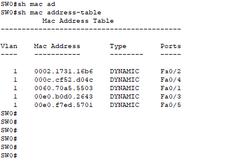

# [스위치]

2L 주소인 MAC 주소를 기반으로 동작하며 네트워크 중간에서 패킷을 받아 필요한 곳에만 보내주는 네트워크를 중재하는 장비  

이전에는 프레임을 전송할 때 경쟁이 일어나 성능저하가 일어났고 프레임을 동시에 여러 장비가 서로 간섭 없이 통신 하도록 도와주기 위해 스위치라는 장비가 생겨났다   \
스위치를 사용하면 여러대의 컴퓨터가 동시에 통신할 수 있게 된다   

스위치의 핵심 역할은 누가 어느 위치에 있는지 파악하여 실제 통신이 시작될 때 자신이 알고 있는 위치로 프레임을 정확히 전송하는 것이다   
이러한 동작이 가능하게 된 이유로는 단말의 MAC 주소와 단말이 위치하는 인터페이스 정보를 담고 있는 `MAC 테이블` 이 있기에 가능하다    

   
[출처](https://www.geeksforgeeks.org/mac-address-table-on-a-cisco-switches/)   

전송하려는 프레임의 헤더 안에 있는 2L 목적지 주소를 확인하고 MAC 주소 테이블에서 포트를 확인해 해당 패킷을 그 포트로만 전송한다   

스위치의 이런 동작을 다음 3가지로 정리할 수 있다   

## [플러딩 (Flooding)]

스위치는 부팅시 네트워크 관련 정보가 아무 것도 없다   
이때 스위치는 네트워크 통신을 중재하지 않고 허브처럼 동작한다   
허브는 패킷이 들어온 포트를 제외하고 모든 포트로 패킷을 전달하는데 이와 같이 스위치가 허브처럼 동작하는 것을 플러딩 이라 한다   
브로드캐스트도 플러딩 처리를 한다   

스위치가 프레임을 플러딩 한다는 것은 스위치가 제 기능을 못한다는 뜻이다   
실제 이더넷-TCP/IP 네트워크에서는 ARP 브로드캐스트를 미리 주고 받은 후 데이터가 전달되므로 실제로는 스위치가 패킷을 플러딩하지 않는다   
일부러 엉뚱한 MAC 주소를 습득 시키거나 MAC 테이블을 꽉 차게 하면 플러딩이 일어날 수 는 있지만 아무 이유없이 플러딩이 일어난다면 스위치가 정상작동을 하지 못하거나 주변에서 공격을 당하고 있음을 알아야 한다   
이 외에도 ARP 포이즈닝 기법을 통해 모니터링해야 할 IP 의 MAC 주소가 공격자 자신인 것 처럼 속여 원하는 통신을 받는 방법도 있다    

## [어드레스 러닝 (Address Learning)]

MAC 주소 테이블을 만들고 유지하는 과정   

프레임이 들어오면 헤더를 통해 들어온 포트번호와 출발지 MAC 주소를 MAC 주소 테이블에 저장한다   

**사전 정의된 MAC 주소 테이블**

	대부분 스위치 간 통신을 위해 사용되는 주소로 특정 포트로 내보내는 것이 아닌 스위치 자체 처리를 하므로   
	인접 포트 번호가 없거나 CPU 혹은 관리 모듈을 지칭하는 용어로 표기된다   

## [포워딩 / 필터링 (Forwarding / Filtering)]

프레임이 스위치에 들어온 경우 도착지 MAC 주소를 확인하고 매치되면 포워딩을 하고 이때 다른 포트에는 데이터를 전송하지 않으므로 이를 필터링 이라 한다   
스위치에서는 포워딩과 필터링 작업이 여러 포트에서 동시에 수행될 수 있어 통신이 다른 포트에 영향을 미치지 않으므로 다른포트에서 기존 통신작업으로부터 독립적으로 동작할 수 있다   

일반적인 유니캐스트에 대해서만 포워딩, 필터링 작업을 수행한다   

[스위치 동작방식 실습](https://blog.naver.com/jga0674/220988105487)

## [VLAN]

스위치에서 사용하는 가상화 기술   

물리적 배치와 상관없이 LAN 을 논리적으로 분할, 구성하는 기술이다   
여러 단말들의 성능 저하, 보안 향상을 위한 차단 용도, 서비스 성격에 따라 별도로 네트워크를 분리하기위해 만들어졌다   

VLAN 을 나누면 하나의 장비를 서로 다른 네트워크를 갖도록 분할한 것이므로 유니캐스트 뿐만아니라 브로드캐스트도 VLAN 간에 통신할 수 없다   
통신을 하기위해서는 3L 장비가 필요하다   

VLAN 에는 몇가지 종류가 있다.

1. Port-based
2. MAC-based
3. Protocol-based
4. IP-based

일반적으로 언급하는 VLAN 은 Port-based 로 `StaticVLAN` 이라고도 불리우며 앞으로 나오는 모든 내용은 전부 포트기반 VLAN 이다

### [VLAN 모드 (Trunk / Access) / 동작방식]

스위치의 각 포트에 각각 사용할 VLAN 을 설정하는데 한 대의 스위치에 연결되더라도 서로 다른 VLAN 이 설정된 포트 간에는 통신할 수 없다   
통신하기 위해서는 3L 장비가 필요하다   

#### [Trunk (tagged)]

	스위치 간 프레임 전달에 하나의 물리적 연결(포트)를 공유, 
	VLAN Trunking 된 스위치들 간에 여러 VLAN에서 나온 프레임들을 이 Trunk 를 통해 전달함   

[정보통신기술용어해설](http://www.ktword.co.kr/test/view/view.php?nav=2&no=3478&sh=Trunk)

VLAN 끼리 추가로 통신하려면 해당 Trunk 포트를 늘리면 된다

그런데... 어떻게 해당 프레임이 특정 VLAN 에서 나온건지 알 수가 있을까?
2L 에서는 프레임에 IP 주소가 부여된것도 아닌데 말이다   
그렇기에 이더넷 프레임에 태그를 삽입해 Trunk 포트를 지나는 이더넷 프레임의 VLAN ID 를 구별할 수 있도록 하기위한 방안으로 `IEEE 802.1Q` 가 있다   

	IEEE 802.1Q
	주로, VLAN(가상 LAN) 상에서, 스위치 간에 VID(VLAN Identifier) 정보를 전달하는 방법
     - 이더넷 프레임 내에 덧붙이는 32 비트 길이의 태그 방식에 대한 IEEE 802 표준

[정보통신기술용어해설](http://www.ktword.co.kr/test/view/view.php?nav=2&no=2136&sh=IEEE+802.1Q)   

   

이렇게 태그를 달게되면 MAC 주소 테이블에도 변화가 생기는데, 다른 VLAN 끼리 통신하지 못하도록 MAC 테이블에 VLAN 을 지정하는 필드가 추가가 된다

   

이렇게 태그를 붙이기에 `Tagged Port` 라고도 한다   

[출처](https://www.geeksforgeeks.org/mac-address-table-on-a-cisco-switches/)   

#### [Access]

VLAN 간의 통신이 아닌 하나의  VLAN 만 설정된 포트를 `Untagged`, `Access Port` 라고 한다   

스위치 간의 연결이 아닌 서버와 연결된 포트도 특정 가상화 서버가 연결될 때는 여러 VLAN 과 통신해야할 때도 있기에 `Tagged Port` 로 설정하기도한다.   
이유는 단순한데 가상화 서버 내부에 가상 스위치가 존재하기 때문이다   

# [STP]

	스패닝 트리 프로토콜 (STP, Spanning Tree Protocol)

  	브리지/스위치로 연결 구성된 네트워크들에서, 
     - Physical Loop (끊임없이 계속되는 루프 순환)를 발견,방지,제거하는 프로토콜

IT 환경에서 하나의 장비 고장으로 전체 네트워크가 마비되는 일이 생길 수 있다      
이러한 상황을 `SPoF` 라고 부르며 해당 일이 일어나지 않도록 이중화, 다중화된 네트워크를 디자인하고 구성해야한다   

