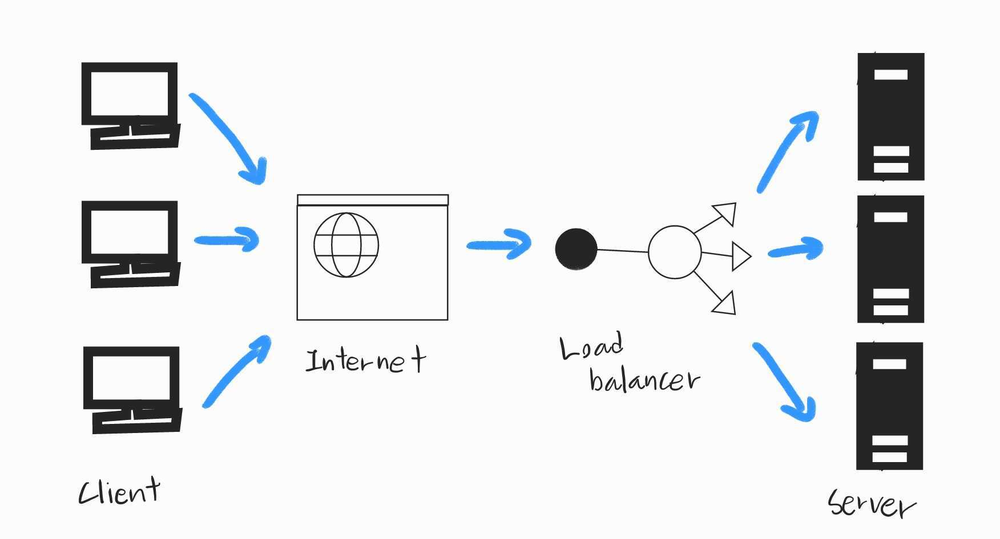
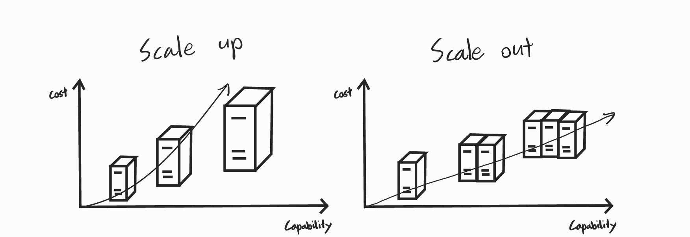
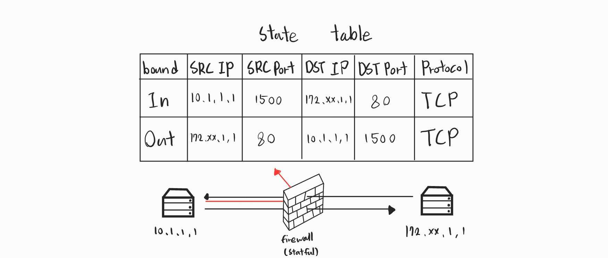

## [4 Layer](#4-layer)
## [로드 밸런서](#로드-밸런서load-balancer)
## [용어 정리](#용어-정리)

---
# 4 Layer

4계층 장비는 TCP와 같은 4계층 헤더에 있는 정보를 이해하고 이 정보들을 기반으로 동작한다   
기존의 2, 3계층의 장비와는 달리 [세션](#session)테이블과 그 안에서 관리하는 세션 정보가 가장 중요하다   
그렇기에 4계층 이상에서 동작하는 로드 밸런서, 방화벽과 같은 장비를 `세션 장비` 라고 부르기도 한다   

세션 장비는 세션 테이블을 기반으로 운영되며   
1. 세션 정보를 저장, 확인
2. 세션 테이블에 남아있는 라이프타임
3. 대칭 경로 요구 (Inboud, Outbound 경로가 일치 해야함)
4. 정보 변경 (로드 밸런서에 한해)   
   
이러한 요소들이 서비스에 영향을 끼치므로    
`네트워크 인프라, 시스템 설계, 애플리케이션 개발`에도    
세션 장비에 대한 고려가 필요하다   

# 로드 밸런서(Load Balancer)

서버나 장비의 부하를 분산하기 위해 사용하는 장비, [Load Balancing](#load-balancing-load-sharing) 을 사용

정확히 말하자면 트래픽을 분산해주는 장비로 주로 웹 서버, FWLB, VPNLB에서 많이 쓰인다   

   

로드 밸런서에는 동작하는 계층에 따라 4 Layer, 7Layer로 나뉜다   

#### L4 로드밸런서

	일반적인 로드 밸런서가 동작하는 방식
	TCP, UDP 정보를 기반으로 수행
	최근에는 L4, L7 기능을 모두 지원하기에 L4 전용 로드밸런서는 거의 없지만 
	L7 지원여부와 상관없이 L4 에 대한 정보로만 분산 처리하는 경우를 `L4 로드 밸런싱` 이라고한다

#### L7 로드밸런서

	HTTP, FTP, SMTP 와 같은 애플리케이션 프로토콜 정보를 기반으로 수행
	`ADC` 라고도 불리우며 proxy 역할을 수행하며 Squid, Nginx 에서 수행하는 Reverse proxy와 유사한 기능을 가지고 있다   
[proxy](#proxy)

#### 클라우드에서의 로드밸런서

	데이터 센터에서의 로드밸런서 장비는 두 계층을 모두 지원하며 설정에 따라 나뉜다   
	반면, 클라우드에서는 두 계층을 지원하는 컴포넌트를 계층별로 구분해 전용으로 사용한다
	ex) NLB(L4), ALB(L7)

## L4 스위치

4L 에서 동작하는 로드밸런서 기능이 있는 스위치   
여러개의 포트를 가지고 로드밸런싱을 수행   
서버형, 소프트웨어 형태의 로드밸런서도 존재하나, L4 스위치는 다양한 네트워크 구성이 가능해 가장 대중화 되어있다   
부하 분산, 성능 최적화, 리다이렉트 기능을 제공한다   

TCP 계층에서의 최적화와 보안 기능도 함께 제공되는데,   
TCP 레벨에서의 간단한 Dos 공격을 방어하거나   
TCP 세션 재사용을 통해 서버 부하를 줄일 수 있다   

## ADC (Application Delivery Controller)

애플리케이션 계층에서 동작하는 로드밸런서   
L4 스위치와 달리 프로토콜의 헤더와 내용을 이해하고 동작하므로 정보 수정 및 필터링과 같은 더 다양한 기능을 제공한다   
이러한 상세한 동작을 위해 proxy 로 동작한다   
대부분의 ADC는 아래와 같은 기능들을 제공한다   
1. 4L ~ 7L 까지의 로드밸런싱
2. 애플리케이션 프로토콜 최적화
3. 캐싱
4. 압축
5. 콘텐츠 변환 및 재 작성
6. 인코딩
등등 ...

여기에 더해 플러그인 형태로 보안 강화 기능을 추가로 제공해 WAF 기능이나 HTML, XML 검증과 변환을 수행할 수 있다   

ADC는 성능 최적화를 위해 서버에서 수행하는 작업중 부하가 많이 걸리는 작업을 별도로 수행한다   
대표적으로
이미지 및 정적 콘텐츠 캐싱 (Caching) 과 압축 기능이 있다   

최근 웹 보안을 위해 [SSL](#ssl-secure-sockets-layer) 프로토콜을 사용하는 곳이 많아지면서 웹 서버에 암복호화 부하가 늘고 있다   
그렇기에 ADC에서 SSL의 엔드 포인트로 동작해 클라이언트에서 ADC까지의 구간을 SSL로 처리하고 ADC부터 서버 까지를 일반 HTTP를 통해 통신한다   
대부분 이런 기능을 사용할 때에는 여러 SSL 통신을 하나의 ADC에서 수횽하기위해 ADC에 전용 SSL 가속 카드를 내장한다   
이를 `SSL 오프로딩` 이라한다   

## 시스템 확장방법 (Scale up, Scale out)

|  | 스케일 업 (Scale up) | 스케일 아웃 (Scale out) |
|:-:|:-:|:-:|
| 설명 | 서버 하드웨어 성능을 업그레이드 하는 방법 | 여러대의 서버로 로드를 분산하는 방법 |
| 확장성 | 성능 확장에 한계 존재 | 공간만 있다면 지속적 확장 가능 |
| 서버 비용 | 시스템이 커질수록 비용이 기하급수적으로 증가 | 스케일 업에 대비 비용이 적음 |
| 관리 | 변화 없음 | 서버가 늘어날수록 관리 편의성이 떨어짐과 운영비용 증가 |
| 장애 영향 | 장애 발생시 다운타임 발생 | 장애 발생시 전면 장애 가능성 적음 |

이 반대로 사용자가 줄게되면 시스템을 축소시켜야하는데 그 방법으로는 Scale down, Scale in 이 있다     
Scale down은 그냥 더 작은 시스템으로 서비스를 옮기고 Scale in 은 기존에 나누었던 시스템을 통합해 더 적은 가짓수로 축소하는 방식이다   

# 방화벽 (Firewall)

서로 다른 보안레벨의 네트워크 경로 사이에 위치해 통과하는 트래픽을 사전에 주어진 정책 조건에 맞추어 `허용`, `차단`을 결정 하는 장비   
네트워크에 보안을 제공하는 장비를 넓은 의미에서 방화벽이라고 불렀으나 일반적으로 3, 4L에서 세션을 인지, 관리하는 [SPI](#spi-stateful-inspection-stateful-packet-inspection) 엔진 기반 장비를 방화벽이라 한다    

NAT 동작 방식과 유사하게 session 정보를 장비 내부에 저장하여 들어오는 패킷을 상세히 로깅하고 관찰할 수 있다    
이러한 session 들을 모아놓은것을 보고 `session table` 이라한다   

## 유의점

이러한 session 장비는 테이블 정보를 이용해 패킷을 변경하거나 애플리케이션 성능을 최적화하고 보안을 강화하기위해 패킷을 `Forward` 하거나 `Drop` 할 수 있다   
그렇기에 위의 기능을 활용하기 위해서 애플리케이션과 session 장비 간에 정보를 동일하게 해주거나 기능을 추가해주면서 비대칭 경로를 피해야한다   

### 타임아웃

만들어진 세션 테이블은 무한히 지속되지 않고 일정 기간의 수명을 가지는데 이는 악의적인 공격에 대비해 만들어진 보안책이다   
하지만 때로 이러한 타임아웃(수명)값이 애플리케이션과 동기화가 되어있지 않아 애플리케이션에서는 세션정보를 가지고 있으나 방화벽에서 세션정보가 만료되어 들어오는 패킷을 drop 하는 경우가 있다   

이러한 문제를 해결하기위해 2가지 관점에서 바라볼 수 있다   

- 세션 장비 운영자
  
	- 세션 장비 만료시간 증가
    - 중간 패킷 수용 방화벽 설정 (보안에 취약)
    - 세션 타임아웃시 양 단말에 세션 종료 통보

- 애플리케이션 개발자

	- Health Check   
		애플리케이션에서 주기적인 더미 패킷을 보내 세션 타임아웃이 발생하기전에 수명을 갱신하는 역할을 한다

### 비대칭 경로

네트워크의 안정성을 위해 회선과 장비를 이중화하는데 이 때, 패킷의 Inbound 와 Outbound 가 서로 다른 장비를 통과하는 것을 `비대칭 경로`라고 한다   
그 반대로 동일한 장비를 통과할 때에는 `대칭 경로`라고한다   

이러한 비대칭 경로를 처리하기위해서는 다음과 같은 방법들이 있다   

- 세션 테이블 동기화   
	방화벽 장비들의 세션 테이블을 동기화 시키는 것   

- 세션 장비에서의 보정   
	Inbound 패킷이 통과한적이 없는데 Outbound 패킷이 들어온경우 다른 세션 장비로 패킷을 보내 경로를 보정하는것   
	이 방법으로는 방화벽 간 통신용 링크가 필요하며 `MAC Rewriteing`, `Tenneling` 과 같은 기법들로 경로를 보정하는데 세부기술과 용어는 구현하는 회사마다 다르므로 각 장비마다 별도로 확인해야한다   

### 하나의 통신, 두 개 이상의 세션

특별한 경우, 하나의 통신에 2개 이상의 세션을 만드는 경우가 있다   
이러한 경우에 서로 다른 세션들이 하나의 통신을 위해 사용하고 있다는 것을 네트워크 중간에 놓인 세션 장비도 알아야 한다   
그렇지 못하면 단방향 통신만 가능하거나 아예 통신이 안될 수도 있다   

대표적인 예로 FTP (File Transfer Protocol) 이 존재하는데   
FTP는 [데이터 프로토콜과 컨트롤 프로토콜](#데이터-컨트롤-프로토콜)이 서로 분리되어 통신방법이 다른 두 가지 모드를 가지고 있다   

우선 들어가기 앞서 FTP에 대해 알아보자면   
하나의 호스트에서 다른 호스트로 파일을 복사하기 위한 TCP/IP 프로토콜이다   
20번, 21번 포트가 존재하며 각기 데이터, 컨트롤을 위해 사용된다   

- Active (default)   

	컨트롤 프로토콜과 데이터 프로토콜의 방향이 반대인 경우   
	1. 클라이언트가 1023번 이상의 TCP 포트를 사용하여 21번 포트에 접속
	2. 클라이언트가 서버에 특정 포트 번호를 사용해 수신하겠다고 알림
	3. 서버가 특정 포트 번호를 사용하겠다고 응답
	4. 해당 특정 포트 번호로 접속하여 데이터 채널 생성
	5. 서버에서 데이터를 보냄, 클라이언트에서 응답하고 데이터를 수신

	여기서 중간에 방화벽이나 세션 장비가 있으면 FTP 접속은 되지만 이후 데이터 채널 연결이 불가능하여 파일을 받을 수 없다    
	그렇기에 Active 모드의 동작 방식에 맞게 방화벽을 열어주어야 한다   

- Passive   

	컨트롤 프로토콜과 데이터 프로토콜의 방향이 같은 경우
	1. 클라이언트가 1023번 이상의 TCP 포트를 사용하여 21번 포트에 접속
	2. 클라이언트가 Passive 모드를 사용하겠다고 알림
	3. 서버가 클라이언트에 수신에 사용할 특정 포트 번호를알림   
	4. 해당 특정 포트번호로 데이터 채널 생성
	5. 클라이언트에서 서버(특정 포트 번호)에 데이터를 요청 
	6. 데이터 전송 

	이 경우 방화벽이 있어도 동작할 수 있지만 서버 쪽에 방화벽이 있을시 데이터 다운로드를 위한 추가 포트만 열어주기만하면 된다   

# 용어 정리

#### Load Balancing, Load Sharing
  
	- 부하를 고루 분담시켜 한곳에 과다하게 집중되는 것을 막는다는 일반적인 용어
	- 병렬로 운용되고 있는 기기 사이에서 부하가 가능한 한 균등하게 분산 할당 시키는 것
[정보통신기술용어해설](http://www.ktword.co.kr/test/view/view.php?nav=2&no=2449&sh=%EB%A1%9C%EB%93%9C+%EB%B0%B8%EB%9F%B0)

#### Session
  
	ㅇ [통신계층]  네트워크 상에서, 양 종단간 일회용 논리적 연결 
     - 例) SVC (가상회선), TCP 세션 등

  	ㅇ [다중처리시스템]  다중사용자 컴퓨터에서, 한 사용자가 로그인 후 ~ 로그아웃 까지의 경과
     - 이 경우, 사용 이력 기록을 세션 로그(Log) 라고 함

  	※ 통상, 서버 등 다중 세션 가능 장비들은, 
       - 수없이 많이 연결된 동시 세션의 처리 능력을 갖추어야 함
[정보통신기술용어해설](http://www.ktword.co.kr/test/view/view.php?nav=2&no=465&sh=%EC%84%B8%EC%85%98%EC%9E%A5%EB%B9%84)

#### Proxy

프록시에는 2가지 종류가 있는데 일반적으로 흔히 아는 프록시를 Forward Proxy 라고 하며 그 외에는 Reverse Proxy 가 있다   

**Forward Proxy**   
	
	Client 와 Server 사이에 위치하여 요청을 중계한다
	클라이언트를 숨겨준다   

**Reverse Proxy**

	Forward Proxy와 마찬가지로 요청과 응답이 Proxy Server로 이동하나   
	서버들이 주로 내부망으로 구성되어 프록시에만 연결을 허용하면서 서버를 숨겨주고 보안 채널을 구축한다   
	Clinet가 Server에 직접 접근이 불가해지면서 Load Balancing의 역할을 수행하기도한다   

#### SSL (Secure Sockets Layer)

암호화 기반 인터넷 보안 프로토콜   
웹상의 데이터는 본래 텍스트로 제작되었으나 누군가 가로챌 수 있는 가능성이 있기에   
개인정보 보호를 위해 웹에서 전송되는 데이터를 암호화 하여 보안을 향상시켰다   

SSL은 크게 3가지 동작이 있다   
1. 웹에서 전송되는 데이터 암호화
2. 두 통신 장치 사이에 핸드셰이크라는 인증 프로세스를 사용
3. 디지털 서명을 통해 데이터 조작여부를 검사하여 데이터 무결성 제공

#### SPI (Stateful Inspection, Stateful Packet Inspection)

상태 반영 검사   
일반적으로 방화벽에서는 패킷을 검사할 때, 한 번에 하나씩 처리하기에 TCP와 같이 여러 패킷으로 분할되어 오는 경우   
목적지 도착 전까지 보안 여부를 알 수 없기에 패킷들 사이에서 순서와 조건들을 추적하는 검사   

#### 데이터, 컨트롤 프로토콜

- 데이터 프로토콜

	네트워크를 통해 실제 데이터를 전송하는데 사용하는 프로토콜
	ex) 전송 계층 프로토콜

- 컨트롤 프로토콜

	네트워크의 구성, 관리, 제어 등과 같은 네트워크 서비스를 관리하며 네트워크 동작을 조정하는 프로토콜
	ex) 라우팅 프로토콜

